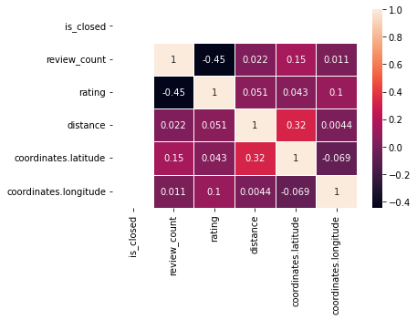
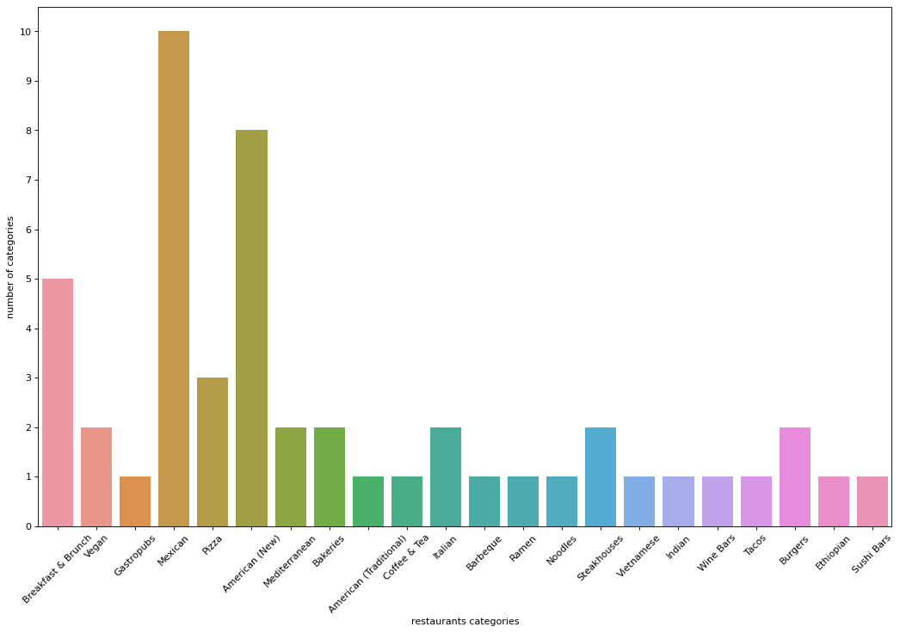

```python
import pandas as pd
from datetime import datetime
import numpy as np
import warnings
warnings.filterwarnings("ignore")
import seaborn as sns
import matplotlib.pyplot as plt
import folium
from folium import Choropleth, Circle, Marker
from folium.plugins import HeatMap, MarkerCluster
from yelpapi import YelpAPI
from pandas.io.json import json_normalize
from mpl_toolkits.basemap import Basemap
yelp_api = YelpAPI('cb0BcM2j1mJY8J7UGOGkrYy0KoMerRp6PM1zHhfbZjWLoAtbjeJtu84eYdTZ6wHa6zJkgyC4d7QXDeLWPU1AVLWt0RP5kArdH9q0DyHk4-0I-KdLw3mCDA2IO8n8YXYx')
```


```python
restaurants = yelp_api.search_query(location = 'Tucson, AZ',limit=50)
restaurants
```


    {'businesses': [{'id': 'UCMSWPqzXjd7QHq7v8PJjQ',
       'alias': 'prep-and-pastry-tucson-7',
       'name': 'Prep and Pastry',
       'image_url': 'https://s3-media2.fl.yelpcdn.com/bphoto/vTw6znfxKFHTCIYEG5gWQg/o.jpg',
       'is_closed': False,
       'url': 'https://www.yelp.com/biz/prep-and-pastry-tucson-7?adjust_creative=gtDy8KYA0mFh3tGf8P8oPw&utm_campaign=yelp_api_v3&utm_medium=api_v3_business_search&utm_source=gtDy8KYA0mFh3tGf8P8oPw',
       'review_count': 2302,
       'categories': [{'alias': 'breakfast_brunch', 'title': 'Breakfast & Brunch'},
        {'alias': 'cocktailbars', 'title': 'Cocktail Bars'},
        {'alias': 'newamerican', 'title': 'American (New)'}],
       'rating': 4.5,
       'coordinates': {'latitude': 32.25552801, 'longitude': -110.94349236},
       'transactions': ['delivery'],
       'price': '$$',
       'location': {'address1': '2660 N Campbell Ave',
        'address2': None,
        'address3': None,
        'city': 'Tucson',
        'zip_code': '85719',
        'country': 'US',
        'state': 'AZ',
        'display_address': ['2660 N Campbell Ave', 'Tucson, AZ 85719']},
       'phone': '+15203267737',
       'display_phone': '(520) 326-7737',
       'distance': 1599.4233309949966},
      {'id': 'DVBJRvnCpkqaYl6nHroaMg',
       'alias': 'tumerico-tucson',
       'name': 'Tumerico',
       'image_url': 'https://s3-media2.fl.yelpcdn.com/bphoto/B1SCuszSTev1D-8OHLqXMw/o.jpg',
       'is_closed': False,
       'url': 'https://www.yelp.com/biz/tumerico-tucson?adjust_creative=gtDy8KYA0mFh3tGf8P8oPw&utm_campaign=yelp_api_v3&utm_medium=api_v3_business_search&utm_source=gtDy8KYA0mFh3tGf8P8oPw',
       'review_count': 798,
       'categories': [{'alias': 'vegan', 'title': 'Vegan'},
        {'alias': 'vegetarian', 'title': 'Vegetarian'}],
       'rating': 5.0,
       'coordinates': {'latitude': 32.2277054883809,
        'longitude': -110.934722498059},
       'transactions': ['delivery'],
       'price': '$$',
       'location': {'address1': '2526 E 6th St',
        'address2': '',
        'address3': None,
        'city': 'Tucson',
        'zip_code': '85716',
        'country': 'US',
        'state': 'AZ',
        'display_address': ['2526 E 6th St', 'Tucson, AZ 85716']},
       'phone': '+15202406947',
       'display_phone': '(520) 240-6947',
       'distance': 1961.703871141723},
      {'id': 'hyeo7JQr5uLp-St1MibYAA',
       'alias': 'baja-cafe-tucson-2',
       'name': 'Baja Cafe',
       'image_url': 'https://s3-media3.fl.yelpcdn.com/bphoto/iu_wsA1jNbWLm9gxn1LB2w/o.jpg',
       'is_closed': False,
       'url': 'https://www.yelp.com/biz/baja-cafe-tucson-2?adjust_creative=gtDy8KYA0mFh3tGf8P8oPw&utm_campaign=yelp_api_v3&utm_medium=api_v3_business_search&utm_source=gtDy8KYA0mFh3tGf8P8oPw',
       'review_count': 1171,
       'categories': [{'alias': 'breakfast_brunch', 'title': 'Breakfast & Brunch'},
        {'alias': 'newamerican', 'title': 'American (New)'}],
       'rating': 4.5,
       'coordinates': {'latitude': 32.21976, 'longitude': -110.84333},
       'transactions': ['delivery'],
       'price': '$$',
       'location': {'address1': '7002 E Broadway Blvd',
        'address2': None,
        'address3': '',
        'city': 'Tucson',
        'zip_code': '85710',
        'country': 'US',
        'state': 'AZ',
        'display_address': ['7002 E Broadway Blvd', 'Tucson, AZ 85710']},
       'phone': '+15204954772',
       'display_phone': '(520) 495-4772',
       'distance': 8783.607116783349},
      {'id': '6Cs52T0ItZ5TQ5Qx-UGaMw',
       'alias': 'baja-cafe-on-campbell-tucson',
       'name': 'Baja Cafe on Campbell',
       'image_url': 'https://s3-media3.fl.yelpcdn.com/bphoto/Pl4954atM5qwGUdw6MjKEg/o.jpg',
       'is_closed': False,
       'url': 'https://www.yelp.com/biz/baja-cafe-on-campbell-tucson?adjust_creative=gtDy8KYA0mFh3tGf8P8oPw&utm_campaign=yelp_api_v3&utm_medium=api_v3_business_search&utm_source=gtDy8KYA0mFh3tGf8P8oPw',
       'review_count': 789,
       'categories': [{'alias': 'breakfast_brunch', 'title': 'Breakfast & Brunch'},
        {'alias': 'tradamerican', 'title': 'American (Traditional)'},
        {'alias': 'mexican', 'title': 'Mexican'}],
       'rating': 4.5,
       'coordinates': {'latitude': 32.260591, 'longitude': -110.94385},
       'transactions': ['delivery'],
       'price': '$$',
       'location': {'address1': '2970 N Campbell Ave',
        'address2': '',
        'address3': '',
        'city': 'Tucson',
        'zip_code': '85719',
        'country': 'US',
        'state': 'AZ',
        'display_address': ['2970 N Campbell Ave', 'Tucson, AZ 85719']},
       'phone': '+15203447369',
       'display_phone': '(520) 344-7369',
       'distance': 2061.2209387537655},
      {'id': 'WSx9-iYYyST_umny9sJBFg',
       'alias': 'the-parish-tucson',
       'name': 'The Parish',
       'image_url': 'https://s3-media3.fl.yelpcdn.com/bphoto/At6VU7r-JNZ81gDhMo7Lkg/o.jpg',
       'is_closed': False,
       'url': 'https://www.yelp.com/biz/the-parish-tucson?adjust_creative=gtDy8KYA0mFh3tGf8P8oPw&utm_campaign=yelp_api_v3&utm_medium=api_v3_business_search&utm_source=gtDy8KYA0mFh3tGf8P8oPw',
       'review_count': 1400,
       'categories': [{'alias': 'gastropubs', 'title': 'Gastropubs'},
        {'alias': 'southern', 'title': 'Southern'},
        {'alias': 'cajun', 'title': 'Cajun/Creole'}],
       'rating': 4.5,
       'coordinates': {'latitude': 32.3245, 'longitude': -110.97597},
       'transactions': ['pickup', 'delivery'],
       'price': '$$',
       'location': {'address1': '6453 N Oracle Rd',
        'address2': '',
        'address3': '',
        'city': 'Tucson',
        'zip_code': '85704',
        'country': 'US',
        'state': 'AZ',
        'display_address': ['6453 N Oracle Rd', 'Tucson, AZ 85704']},
       'phone': '+15207971233',
       'display_phone': '(520) 797-1233',
       'distance': 9756.911972791344},
      {'id': 'J-Go00lYW4f4a3lLLtoh_A',
       'alias': 'bobos-restaurant-tucson-3',
       'name': "Bobo's Restaurant",
       'image_url': 'https://s3-media1.fl.yelpcdn.com/bphoto/HxLqTk4EqUcPYpqnChmVGw/o.jpg',
       'is_closed': False,
       'url': 'https://www.yelp.com/biz/bobos-restaurant-tucson-3?adjust_creative=gtDy8KYA0mFh3tGf8P8oPw&utm_campaign=yelp_api_v3&utm_medium=api_v3_business_search&utm_source=gtDy8KYA0mFh3tGf8P8oPw',
       'review_count': 791,
       'categories': [{'alias': 'breakfast_brunch', 'title': 'Breakfast & Brunch'},
        {'alias': 'burgers', 'title': 'Burgers'},
        {'alias': 'sandwiches', 'title': 'Sandwiches'}],
       'rating': 4.5,
       'coordinates': {'latitude': 32.2500799, 'longitude': -110.92799},
       'transactions': ['delivery'],
       'price': '$',
       'location': {'address1': '2938 E Grant Rd',
        'address2': '',
        'address3': '',
        'city': 'Tucson',
        'zip_code': '85716',
        'country': 'US',
        'state': 'AZ',
        'display_address': ['2938 E Grant Rd', 'Tucson, AZ 85716']},
       'phone': '+15203266163',
       'display_phone': '(520) 326-6163',
       'distance': 654.0269962187406},
      {'id': 'RHdEScVIAQ7xzFFMiQEnAQ',
       'alias': 'the-quesadillas-tucson',
       'name': 'The Quesadillas',
       'image_url': 'https://s3-media2.fl.yelpcdn.com/bphoto/p2bfZEsLz1Hi4NtLVQmywA/o.jpg',
       'is_closed': False,
       'url': 'https://www.yelp.com/biz/the-quesadillas-tucson?adjust_creative=gtDy8KYA0mFh3tGf8P8oPw&utm_campaign=yelp_api_v3&utm_medium=api_v3_business_search&utm_source=gtDy8KYA0mFh3tGf8P8oPw',
       'review_count': 544,
       'categories': [{'alias': 'mexican', 'title': 'Mexican'}],
       'rating': 4.5,
       'coordinates': {'latitude': 32.251377455959386,
        'longitude': -110.87498140841916},
       'transactions': ['delivery'],
       'price': '$',
       'location': {'address1': '2418 N Craycroft Rd',
        'address2': '',
        'address3': '',
        'city': 'Tucson',
        'zip_code': '85712',
        'country': 'US',
        'state': 'AZ',
        'display_address': ['2418 N Craycroft Rd', 'Tucson, AZ 85712']},
       'phone': '+15202961345',
       'display_phone': '(520) 296-1345',
       'distance': 5378.698960587908},
      {'id': '6OwxdpajDSJi3DkMqkr2sw',
       'alias': 'barista-del-barrio-tucson-2',
       'name': 'Barista Del Barrio',
       'image_url': 'https://s3-media1.fl.yelpcdn.com/bphoto/KDAEvGjFSrXJZC9QIrbCbA/o.jpg',
       'is_closed': False,
       'url': 'https://www.yelp.com/biz/barista-del-barrio-tucson-2?adjust_creative=gtDy8KYA0mFh3tGf8P8oPw&utm_campaign=yelp_api_v3&utm_medium=api_v3_business_search&utm_source=gtDy8KYA0mFh3tGf8P8oPw',
       'review_count': 428,
       'categories': [{'alias': 'breakfast_brunch', 'title': 'Breakfast & Brunch'},
        {'alias': 'cafes', 'title': 'Cafes'}],
       'rating': 5.0,
       'coordinates': {'latitude': 32.2348699739027,
        'longitude': -110.989975703106},
       'transactions': ['delivery'],
       'price': '$',
       'location': {'address1': '1002 N Grande Ave',
        'address2': '',
        'address3': None,
        'city': 'Tucson',
        'zip_code': '85745',
        'country': 'US',
        'state': 'AZ',
        'display_address': ['1002 N Grande Ave', 'Tucson, AZ 85745']},
       'phone': '+15202445285',
       'display_phone': '(520) 244-5285',
       'distance': 5598.921040362977},
      {'id': 'j8feOxyJqlIJWOi8su2qzw',
       'alias': 'serial-grillers-tucson-4',
       'name': 'Serial Grillers',
       'image_url': 'https://s3-media1.fl.yelpcdn.com/bphoto/bJk3ZVcXyTLn_h3evqoFzA/o.jpg',
       'is_closed': False,
       'url': 'https://www.yelp.com/biz/serial-grillers-tucson-4?adjust_creative=gtDy8KYA0mFh3tGf8P8oPw&utm_campaign=yelp_api_v3&utm_medium=api_v3_business_search&utm_source=gtDy8KYA0mFh3tGf8P8oPw',
       'review_count': 1039,
       'categories': [{'alias': 'pizza', 'title': 'Pizza'},
        {'alias': 'sandwiches', 'title': 'Sandwiches'},
        {'alias': 'cheesesteaks', 'title': 'Cheesesteaks'}],
       'rating': 4.5,
       'coordinates': {'latitude': 32.236675, 'longitude': -110.865028},
       'transactions': ['pickup', 'delivery'],
       'price': '$$',
       'location': {'address1': '5975 E Speedway Blvd',
        'address2': '',
        'address3': '',
        'city': 'Tucson',
        'zip_code': '85712',
        'country': 'US',
        'state': 'AZ',
        'display_address': ['5975 E Speedway Blvd', 'Tucson, AZ 85712']},
       'phone': '+15205462160',
       'display_phone': '(520) 546-2160',
       'distance': 6341.260605788462},
      {'id': 'zwrgCMuZyFX46mL3piDyjg',
       'alias': 'cup-cafe-tucson',
       'name': 'Cup Cafe',
       'image_url': 'https://s3-media1.fl.yelpcdn.com/bphoto/tjRkRkNIp4TodLMem6qtDw/o.jpg',
       'is_closed': False,
       'url': 'https://www.yelp.com/biz/cup-cafe-tucson?adjust_creative=gtDy8KYA0mFh3tGf8P8oPw&utm_campaign=yelp_api_v3&utm_medium=api_v3_business_search&utm_source=gtDy8KYA0mFh3tGf8P8oPw',
       'review_count': 922,
       'categories': [{'alias': 'newamerican', 'title': 'American (New)'},
        {'alias': 'breakfast_brunch', 'title': 'Breakfast & Brunch'},
        {'alias': 'bars', 'title': 'Bars'}],
       'rating': 4.0,
       'coordinates': {'latitude': 32.22224931496368,
        'longitude': -110.96661006561565},
       'transactions': ['delivery'],
       'price': '$$',
       'location': {'address1': '311 E Congress St',
        'address2': '',
        'address3': 'Hotel Congress',
        'city': 'Tucson',
        'zip_code': '85701',
        'country': 'US',
        'state': 'AZ',
        'display_address': ['311 E Congress St',
         'Hotel Congress',
         'Tucson, AZ 85701']},
       'phone': '+15207981618',
       'display_phone': '(520) 798-1618',
       'distance': 4155.904350614848},
      {'id': 'jmwasbZfgj3honf79qKsnA',
       'alias': 'street-taco-and-beer-co-tucson',
       'name': 'Street- Taco and Beer Co.',
       'image_url': 'https://s3-media4.fl.yelpcdn.com/bphoto/VOaRTnYRNSnSF6DR28fUog/o.jpg',
       'is_closed': False,
       'url': 'https://www.yelp.com/biz/street-taco-and-beer-co-tucson?adjust_creative=gtDy8KYA0mFh3tGf8P8oPw&utm_campaign=yelp_api_v3&utm_medium=api_v3_business_search&utm_source=gtDy8KYA0mFh3tGf8P8oPw',
       'review_count': 864,
       'categories': [{'alias': 'mexican', 'title': 'Mexican'},
        {'alias': 'bars', 'title': 'Bars'}],
       'rating': 4.5,
       'coordinates': {'latitude': 32.222001, 'longitude': -110.972225},
       'transactions': ['delivery'],
       'price': '$',
       'location': {'address1': '58 W Congress St',
        'address2': None,
        'address3': '',
        'city': 'Tucson',
        'zip_code': '85701',
        'country': 'US',
        'state': 'AZ',
        'display_address': ['58 W Congress St', 'Tucson, AZ 85701']},
       'phone': '+15202696266',
       'display_phone': '(520) 269-6266',
       'distance': 4599.43926172535},
      {'id': 'MK0OMY_u9unl8xSqjPLtMw',
       'alias': 'seis-kitchen-tucson-3',
       'name': 'Seis Kitchen',
       'image_url': 'https://s3-media3.fl.yelpcdn.com/bphoto/07-K3Z9wVEq7l6hOuBSkbA/o.jpg',
       'is_closed': False,
       'url': 'https://www.yelp.com/biz/seis-kitchen-tucson-3?adjust_creative=gtDy8KYA0mFh3tGf8P8oPw&utm_campaign=yelp_api_v3&utm_medium=api_v3_business_search&utm_source=gtDy8KYA0mFh3tGf8P8oPw',
       'review_count': 748,
       'categories': [{'alias': 'mexican', 'title': 'Mexican'},
        {'alias': 'bars', 'title': 'Bars'},
        {'alias': 'breakfast_brunch', 'title': 'Breakfast & Brunch'}],
       'rating': 4.5,
       'coordinates': {'latitude': 32.21993, 'longitude': -110.98571},
       'transactions': ['delivery'],
       'price': '$$',
       'location': {'address1': '130 S Avenida Del Convento',
        'address2': 'Ste 100',
        'address3': '',
        'city': 'Tucson',
        'zip_code': '85745',
        'country': 'US',
        'state': 'AZ',
        'display_address': ['130 S Avenida Del Convento',
         'Ste 100',
         'Tucson, AZ 85745']},
       'phone': '+15206222002',
       'display_phone': '(520) 622-2002',
       'distance': 5794.446764129451},
      {'id': '5s7I0Khg7ReVzfO7niJtKg',
       'alias': 'zayna-mediterranean-tucson-2',
       'name': 'Zayna Mediterranean',
       'image_url': 'https://s3-media1.fl.yelpcdn.com/bphoto/_k6QvhH_-kysnPca6DF-Rw/o.jpg',
       'is_closed': False,
       'url': 'https://www.yelp.com/biz/zayna-mediterranean-tucson-2?adjust_creative=gtDy8KYA0mFh3tGf8P8oPw&utm_campaign=yelp_api_v3&utm_medium=api_v3_business_search&utm_source=gtDy8KYA0mFh3tGf8P8oPw',
       'review_count': 640,
       'categories': [{'alias': 'mediterranean', 'title': 'Mediterranean'},
        {'alias': 'mideastern', 'title': 'Middle Eastern'},
        {'alias': 'syrian', 'title': 'Syrian'}],
       'rating': 4.5,
       'coordinates': {'latitude': 32.2373199, 'longitude': -110.89649},
       'transactions': ['delivery'],
       'price': '$$',
       'location': {'address1': '1138 North Belvedere',
        'address2': '',
        'address3': '',
        'city': 'Tucson',
        'zip_code': '85712',
        'country': 'US',
        'state': 'AZ',
        'display_address': ['1138 North Belvedere', 'Tucson, AZ 85712']},
       'phone': '+15208814348',
       'display_phone': '(520) 881-4348',
       'distance': 3416.592162564217},
      {'id': 'tkyHFPJ3dBsjE2hA_tk_sQ',
       'alias': 'tito-and-pep-tucson-2',
       'name': 'Tito & Pep',
       'image_url': 'https://s3-media4.fl.yelpcdn.com/bphoto/JZdDgPdOYdPziHRY1j1yWQ/o.jpg',
       'is_closed': False,
       'url': 'https://www.yelp.com/biz/tito-and-pep-tucson-2?adjust_creative=gtDy8KYA0mFh3tGf8P8oPw&utm_campaign=yelp_api_v3&utm_medium=api_v3_business_search&utm_source=gtDy8KYA0mFh3tGf8P8oPw',
       'review_count': 455,
       'categories': [{'alias': 'newamerican', 'title': 'American (New)'},
        {'alias': 'cocktailbars', 'title': 'Cocktail Bars'}],
       'rating': 4.5,
       'coordinates': {'latitude': 32.2359378837897,
        'longitude': -110.904669545616},
       'transactions': ['delivery'],
       'price': '$$',
       'location': {'address1': '4122 E Speedway Blvd',
        'address2': '',
        'address3': None,
        'city': 'Tucson',
        'zip_code': '85712',
        'country': 'US',
        'state': 'AZ',
        'display_address': ['4122 E Speedway Blvd', 'Tucson, AZ 85712']},
       'phone': '+15202070116',
       'display_phone': '(520) 207-0116',
       'distance': 2741.457157980865},
      {'id': 'jh8j-DWqgWkbRe_a2XtKFQ',
       'alias': 'barrio-bread-tucson-2',
       'name': 'Barrio Bread',
       'image_url': 'https://s3-media1.fl.yelpcdn.com/bphoto/0AK1Dud1GBqaIAPC9PS1HQ/o.jpg',
       'is_closed': False,
       'url': 'https://www.yelp.com/biz/barrio-bread-tucson-2?adjust_creative=gtDy8KYA0mFh3tGf8P8oPw&utm_campaign=yelp_api_v3&utm_medium=api_v3_business_search&utm_source=gtDy8KYA0mFh3tGf8P8oPw',
       'review_count': 249,
       'categories': [{'alias': 'bakeries', 'title': 'Bakeries'}],
       'rating': 5.0,
       'coordinates': {'latitude': 32.220868, 'longitude': -110.928007},
       'transactions': ['delivery'],
       'price': '$$',
       'location': {'address1': '18 S Eastbourne Ave',
        'address2': '',
        'address3': '',
        'city': 'Tucson',
        'zip_code': '85716',
        'country': 'US',
        'state': 'AZ',
        'display_address': ['18 S Eastbourne Ave', 'Tucson, AZ 85716']},
       'phone': '+15203271292',
       'display_phone': '(520) 327-1292',
       'distance': 2722.494907236996},
      {'id': 'muxda1cSVtplETqTfYVgZA',
       'alias': 'hub-restaurant-and-ice-creamery-tucson',
       'name': 'HUB Restaurant & Ice Creamery',
       'image_url': 'https://s3-media3.fl.yelpcdn.com/bphoto/8nZGMwjWZJ515gopqGCtqg/o.jpg',
       'is_closed': False,
       'url': 'https://www.yelp.com/biz/hub-restaurant-and-ice-creamery-tucson?adjust_creative=gtDy8KYA0mFh3tGf8P8oPw&utm_campaign=yelp_api_v3&utm_medium=api_v3_business_search&utm_source=gtDy8KYA0mFh3tGf8P8oPw',
       'review_count': 1345,
       'categories': [{'alias': 'tradamerican', 'title': 'American (Traditional)'},
        {'alias': 'icecream', 'title': 'Ice Cream & Frozen Yogurt'},
        {'alias': 'bars', 'title': 'Bars'}],
       'rating': 4.0,
       'coordinates': {'latitude': 32.22185, 'longitude': -110.96756},
       'transactions': ['pickup', 'delivery'],
       'price': '$$',
       'location': {'address1': '266 E Congress St',
        'address2': None,
        'address3': '',
        'city': 'Tucson',
        'zip_code': '85701',
        'country': 'US',
        'state': 'AZ',
        'display_address': ['266 E Congress St', 'Tucson, AZ 85701']},
       'phone': '+15202078201',
       'display_phone': '(520) 207-8201',
       'distance': 4261.1168000194575},
      {'id': 'zZ01WQlcpI1_n806WKV3bA',
       'alias': 'culinary-dropout-tucson-2',
       'name': 'Culinary Dropout',
       'image_url': 'https://s3-media4.fl.yelpcdn.com/bphoto/LtBt2LHx6JSSSRinc8OT9A/o.jpg',
       'is_closed': False,
       'url': 'https://www.yelp.com/biz/culinary-dropout-tucson-2?adjust_creative=gtDy8KYA0mFh3tGf8P8oPw&utm_campaign=yelp_api_v3&utm_medium=api_v3_business_search&utm_source=gtDy8KYA0mFh3tGf8P8oPw',
       'review_count': 1407,
       'categories': [{'alias': 'newamerican', 'title': 'American (New)'}],
       'rating': 4.0,
       'coordinates': {'latitude': 32.25077, 'longitude': -110.93433},
       'transactions': ['delivery'],
       'price': '$$',
       'location': {'address1': '2543 E Grant Rd',
        'address2': None,
        'address3': None,
        'city': 'Tucson',
        'zip_code': '85716',
        'country': 'US',
        'state': 'AZ',
        'display_address': ['2543 E Grant Rd', 'Tucson, AZ 85716']},
       'phone': '+15202030934',
       'display_phone': '(520) 203-0934',
       'distance': 663.4187621374708},
      {'id': 'CJoO4HYD0tZRXlZqA04wmw',
       'alias': 'crave-coffee-bar-tucson',
       'name': 'Crave Coffee Bar',
       'image_url': 'https://s3-media4.fl.yelpcdn.com/bphoto/_xS2igx6OliDK2P3GpELYQ/o.jpg',
       'is_closed': False,
       'url': 'https://www.yelp.com/biz/crave-coffee-bar-tucson?adjust_creative=gtDy8KYA0mFh3tGf8P8oPw&utm_campaign=yelp_api_v3&utm_medium=api_v3_business_search&utm_source=gtDy8KYA0mFh3tGf8P8oPw',
       'review_count': 468,
       'categories': [{'alias': 'coffee', 'title': 'Coffee & Tea'}],
       'rating': 4.5,
       'coordinates': {'latitude': 32.22102, 'longitude': -110.89557},
       'transactions': [],
       'price': '$$',
       'location': {'address1': '4530 E Broadway',
        'address2': '',
        'address3': '',
        'city': 'Tucson',
        'zip_code': '85711',
        'country': 'US',
        'state': 'AZ',
        'display_address': ['4530 E Broadway', 'Tucson, AZ 85711']},
       'phone': '+15204456665',
       'display_phone': '(520) 445-6665',
       'distance': 4295.488105387117},
      {'id': '4QMIJJWQOh7zpEwOXhFJqw',
       'alias': 'renees-tucson-tucson',
       'name': "Renee's Tucson",
       'image_url': 'https://s3-media4.fl.yelpcdn.com/bphoto/FiASAjbVhd6WUud4BfeJYw/o.jpg',
       'is_closed': False,
       'url': 'https://www.yelp.com/biz/renees-tucson-tucson?adjust_creative=gtDy8KYA0mFh3tGf8P8oPw&utm_campaign=yelp_api_v3&utm_medium=api_v3_business_search&utm_source=gtDy8KYA0mFh3tGf8P8oPw',
       'review_count': 695,
       'categories': [{'alias': 'pizza', 'title': 'Pizza'},
        {'alias': 'italian', 'title': 'Italian'},
        {'alias': 'gluten_free', 'title': 'Gluten-Free'}],
       'rating': 4.5,
       'coordinates': {'latitude': 32.25207, 'longitude': -110.84171},
       'transactions': ['pickup', 'delivery'],
       'price': '$$',
       'location': {'address1': '7065 E Tanque Verde Rd',
        'address2': None,
        'address3': None,
        'city': 'Tucson',
        'zip_code': '85715',
        'country': 'US',
        'state': 'AZ',
        'display_address': ['7065 E Tanque Verde Rd', 'Tucson, AZ 85715']},
       'phone': '+15208860484',
       'display_phone': '(520) 886-0484',
       'distance': 8516.592219373257},
      {'id': 'KZA_HEOsBXf8dtrk9rqNJA',
       'alias': 'prep-and-pastry-on-grant-tucson',
       'name': 'Prep & Pastry on Grant',
       'image_url': 'https://s3-media1.fl.yelpcdn.com/bphoto/FoXlWzRl5gtc8qMhVkKmVg/o.jpg',
       'is_closed': False,
       'url': 'https://www.yelp.com/biz/prep-and-pastry-on-grant-tucson?adjust_creative=gtDy8KYA0mFh3tGf8P8oPw&utm_campaign=yelp_api_v3&utm_medium=api_v3_business_search&utm_source=gtDy8KYA0mFh3tGf8P8oPw',
       'review_count': 714,
       'categories': [{'alias': 'newamerican', 'title': 'American (New)'},
        {'alias': 'breakfast_brunch', 'title': 'Breakfast & Brunch'}],
       'rating': 4.5,
       'coordinates': {'latitude': 32.25014061, 'longitude': -110.85498292},
       'transactions': ['pickup', 'delivery'],
       'price': '$$',
       'location': {'address1': '6450 E Grant Rd',
        'address2': 'Ste 160',
        'address3': '',
        'city': 'Tucson',
        'zip_code': '85715',
        'country': 'US',
        'state': 'AZ',
        'display_address': ['6450 E Grant Rd', 'Ste 160', 'Tucson, AZ 85715']},
       'phone': '+15208380809',
       'display_phone': '(520) 838-0809',
       'distance': 7236.069761984057},
      {'id': 'gciMEyy9sIcwSMREEvNiXA',
       'alias': 'roma-imports-tucson',
       'name': 'Roma Imports',
       'image_url': 'https://s3-media1.fl.yelpcdn.com/bphoto/7znil6X3AjdENtbAUZIp_Q/o.jpg',
       'is_closed': False,
       'url': 'https://www.yelp.com/biz/roma-imports-tucson?adjust_creative=gtDy8KYA0mFh3tGf8P8oPw&utm_campaign=yelp_api_v3&utm_medium=api_v3_business_search&utm_source=gtDy8KYA0mFh3tGf8P8oPw',
       'review_count': 391,
       'categories': [{'alias': 'italian', 'title': 'Italian'},
        {'alias': 'delis', 'title': 'Delis'},
        {'alias': 'cheese', 'title': 'Cheese Shops'}],
       'rating': 4.5,
       'coordinates': {'latitude': 32.2142399, 'longitude': -110.94887},
       'transactions': ['delivery'],
       'price': '$$',
       'location': {'address1': '627 S Vine Ave',
        'address2': '',
        'address3': '',
        'city': 'Tucson',
        'zip_code': '85719',
        'country': 'US',
        'state': 'AZ',
        'display_address': ['627 S Vine Ave', 'Tucson, AZ 85719']},
       'phone': '+15207923173',
       'display_phone': '(520) 792-3173',
       'distance': 3801.615718906949},
      {'id': 'Rv8bW3pkzpi5dZu5ckbgtA',
       'alias': 'guadalajara-original-grill-tucson',
       'name': 'Guadalajara Original Grill',
       'image_url': 'https://s3-media4.fl.yelpcdn.com/bphoto/Z_TZvxX1dwj1DKnwRDvC6w/o.jpg',
       'is_closed': False,
       'url': 'https://www.yelp.com/biz/guadalajara-original-grill-tucson?adjust_creative=gtDy8KYA0mFh3tGf8P8oPw&utm_campaign=yelp_api_v3&utm_medium=api_v3_business_search&utm_source=gtDy8KYA0mFh3tGf8P8oPw',
       'review_count': 1223,
       'categories': [{'alias': 'mexican', 'title': 'Mexican'},
        {'alias': 'breakfast_brunch', 'title': 'Breakfast & Brunch'},
        {'alias': 'bars', 'title': 'Bars'}],
       'rating': 4.0,
       'coordinates': {'latitude': 32.271774, 'longitude': -110.953235},
       'transactions': ['pickup', 'delivery'],
       'price': '$$',
       'location': {'address1': '1220 E Prince Rd',
        'address2': '',
        'address3': '',
        'city': 'Tucson',
        'zip_code': '85719',
        'country': 'US',
        'state': 'AZ',
        'display_address': ['1220 E Prince Rd', 'Tucson, AZ 85719']},
       'phone': '+15203231022',
       'display_phone': '(520) 323-1022',
       'distance': 3585.6068091609413},
      {'id': 'WAInJdS3M-4JgUyzf_LoQg',
       'alias': 'smokey-mo-tucson',
       'name': 'Smokey Mo',
       'image_url': 'https://s3-media2.fl.yelpcdn.com/bphoto/_eo6tpAu6U8VbwO3hxncgw/o.jpg',
       'is_closed': False,
       'url': 'https://www.yelp.com/biz/smokey-mo-tucson?adjust_creative=gtDy8KYA0mFh3tGf8P8oPw&utm_campaign=yelp_api_v3&utm_medium=api_v3_business_search&utm_source=gtDy8KYA0mFh3tGf8P8oPw',
       'review_count': 516,
       'categories': [{'alias': 'bbq', 'title': 'Barbeque'},
        {'alias': 'burgers', 'title': 'Burgers'},
        {'alias': 'sandwiches', 'title': 'Sandwiches'}],
       'rating': 4.5,
       'coordinates': {'latitude': 32.2543430452397,
        'longitude': -110.961033134281},
       'transactions': ['pickup', 'delivery'],
       'price': '$$',
       'location': {'address1': '2650 N 1st Ave',
        'address2': '',
        'address3': None,
        'city': 'Tucson',
        'zip_code': '85719',
        'country': 'US',
        'state': 'AZ',
        'display_address': ['2650 N 1st Ave', 'Tucson, AZ 85719']},
       'phone': '+15202038250',
       'display_phone': '(520) 203-8250',
       'distance': 2941.2308213920605},
      {'id': 'Bq0CQcwk5R8yhm-MGfHxCA',
       'alias': 'chef-alisahs-tucson',
       'name': "Chef Alisah's",
       'image_url': 'https://s3-media1.fl.yelpcdn.com/bphoto/uGrchNzQaAFAQKKiPdA-7Q/o.jpg',
       'is_closed': False,
       'url': 'https://www.yelp.com/biz/chef-alisahs-tucson?adjust_creative=gtDy8KYA0mFh3tGf8P8oPw&utm_campaign=yelp_api_v3&utm_medium=api_v3_business_search&utm_source=gtDy8KYA0mFh3tGf8P8oPw',
       'review_count': 510,
       'categories': [{'alias': 'mediterranean', 'title': 'Mediterranean'},
        {'alias': 'modern_european', 'title': 'Modern European'}],
       'rating': 4.5,
       'coordinates': {'latitude': 32.314993, 'longitude': -110.977809},
       'transactions': ['delivery'],
       'price': '$$',
       'location': {'address1': '5931 N Oracle Rd',
        'address2': '',
        'address3': '',
        'city': 'Tucson',
        'zip_code': '85704',
        'country': 'US',
        'state': 'AZ',
        'display_address': ['5931 N Oracle Rd', 'Tucson, AZ 85704']},
       'phone': '+15208875305',
       'display_phone': '(520) 887-5305',
       'distance': 8892.790667779836},
      {'id': 'UjQnH-pElJZ9jD51vOt5Rw',
       'alias': 'wildflower-tucson',
       'name': 'Wildflower',
       'image_url': 'https://s3-media4.fl.yelpcdn.com/bphoto/zZbsoIK7TTbZIzMA53hFQA/o.jpg',
       'is_closed': False,
       'url': 'https://www.yelp.com/biz/wildflower-tucson?adjust_creative=gtDy8KYA0mFh3tGf8P8oPw&utm_campaign=yelp_api_v3&utm_medium=api_v3_business_search&utm_source=gtDy8KYA0mFh3tGf8P8oPw',
       'review_count': 868,
       'categories': [{'alias': 'newamerican', 'title': 'American (New)'}],
       'rating': 4.5,
       'coordinates': {'latitude': 32.335824, 'longitude': -110.978137},
       'transactions': [],
       'price': '$$',
       'location': {'address1': '7037 N Oracle Rd',
        'address2': '',
        'address3': '',
        'city': 'Tucson',
        'zip_code': '85704',
        'country': 'US',
        'state': 'AZ',
        'display_address': ['7037 N Oracle Rd', 'Tucson, AZ 85704']},
       'phone': '+15202194230',
       'display_phone': '(520) 219-4230',
       'distance': 10948.31015528907},
      {'id': '3StNEgKAwpCFR1q0urmJrw',
       'alias': 'raijin-ramen-tucson',
       'name': 'Raijin Ramen',
       'image_url': 'https://s3-media4.fl.yelpcdn.com/bphoto/H5QJMg2PvbNl37054oRaPA/o.jpg',
       'is_closed': False,
       'url': 'https://www.yelp.com/biz/raijin-ramen-tucson?adjust_creative=gtDy8KYA0mFh3tGf8P8oPw&utm_campaign=yelp_api_v3&utm_medium=api_v3_business_search&utm_source=gtDy8KYA0mFh3tGf8P8oPw',
       'review_count': 631,
       'categories': [{'alias': 'ramen', 'title': 'Ramen'}],
       'rating': 4.5,
       'coordinates': {'latitude': 32.2364532419853,
        'longitude': -110.928393783342},
       'transactions': ['delivery'],
       'price': '$$',
       'location': {'address1': '2995 E Speedway',
        'address2': '',
        'address3': None,
        'city': 'Tucson',
        'zip_code': '85716',
        'country': 'US',
        'state': 'AZ',
        'display_address': ['2995 E Speedway', 'Tucson, AZ 85716']},
       'phone': '+15207953123',
       'display_phone': '(520) 795-3123',
       'distance': 1017.0643941124891},
      {'id': 'LRr-aw58xVMkUu0OSL_BpQ',
       'alias': 'the-little-one-tucson',
       'name': 'The Little One',
       'image_url': 'https://s3-media3.fl.yelpcdn.com/bphoto/DmLtSfYuveyXK8NwAjg1hg/o.jpg',
       'is_closed': False,
       'url': 'https://www.yelp.com/biz/the-little-one-tucson?adjust_creative=gtDy8KYA0mFh3tGf8P8oPw&utm_campaign=yelp_api_v3&utm_medium=api_v3_business_search&utm_source=gtDy8KYA0mFh3tGf8P8oPw',
       'review_count': 362,
       'categories': [{'alias': 'mexican', 'title': 'Mexican'}],
       'rating': 4.5,
       'coordinates': {'latitude': 32.223991394043,
        'longitude': -110.971878051758},
       'transactions': ['delivery'],
       'price': '$$',
       'location': {'address1': '151 N Stone Ave',
        'address2': None,
        'address3': '',
        'city': 'Tucson',
        'zip_code': '85701',
        'country': 'US',
        'state': 'AZ',
        'display_address': ['151 N Stone Ave', 'Tucson, AZ 85701']},
       'phone': '+15206129830',
       'display_phone': '(520) 612-9830',
       'distance': 4440.236265602531},
      {'id': 'q9HeBXQBnXgThOa9DPIhAw',
       'alias': '5-points-market-and-restaurant-tucson',
       'name': '5 Points Market & Restaurant',
       'image_url': 'https://s3-media4.fl.yelpcdn.com/bphoto/KOZ8zPo8ZAt7pYDH5SYYIw/o.jpg',
       'is_closed': False,
       'url': 'https://www.yelp.com/biz/5-points-market-and-restaurant-tucson?adjust_creative=gtDy8KYA0mFh3tGf8P8oPw&utm_campaign=yelp_api_v3&utm_medium=api_v3_business_search&utm_source=gtDy8KYA0mFh3tGf8P8oPw',
       'review_count': 598,
       'categories': [{'alias': 'newamerican', 'title': 'American (New)'},
        {'alias': 'breakfast_brunch', 'title': 'Breakfast & Brunch'},
        {'alias': 'vegetarian', 'title': 'Vegetarian'}],
       'rating': 4.5,
       'coordinates': {'latitude': 32.2122004, 'longitude': -110.9690903},
       'transactions': ['delivery'],
       'price': '$$',
       'location': {'address1': '756 S Stone Ave',
        'address2': '',
        'address3': '',
        'city': 'Tucson',
        'zip_code': '85701',
        'country': 'US',
        'state': 'AZ',
        'display_address': ['756 S Stone Ave', 'Tucson, AZ 85701']},
       'phone': '+15206233888',
       'display_phone': '(520) 623-3888',
       'distance': 5079.506512191318},
      {'id': 'dOOvB4HW-b0mWDpcvY5h-g',
       'alias': 'reilly-craft-pizza-and-drink-tucson',
       'name': 'Reilly Craft Pizza & Drink',
       'image_url': 'https://s3-media4.fl.yelpcdn.com/bphoto/n4-xdKHTezYdA10GPqUV_Q/o.jpg',
       'is_closed': False,
       'url': 'https://www.yelp.com/biz/reilly-craft-pizza-and-drink-tucson?adjust_creative=gtDy8KYA0mFh3tGf8P8oPw&utm_campaign=yelp_api_v3&utm_medium=api_v3_business_search&utm_source=gtDy8KYA0mFh3tGf8P8oPw',
       'review_count': 699,
       'categories': [{'alias': 'italian', 'title': 'Italian'},
        {'alias': 'beergardens', 'title': 'Beer Gardens'}],
       'rating': 4.0,
       'coordinates': {'latitude': 32.22336397096192,
        'longitude': -110.96970981062555},
       'transactions': ['delivery'],
       'price': '$$',
       'location': {'address1': '101 E Pennington St',
        'address2': '',
        'address3': '',
        'city': 'Tucson',
        'zip_code': '85701',
        'country': 'US',
        'state': 'AZ',
        'display_address': ['101 E Pennington St', 'Tucson, AZ 85701']},
       'phone': '+15208825550',
       'display_phone': '(520) 882-5550',
       'distance': 4319.117380886613},
      {'id': 'elP0Xn9HyP6cRBuzbJdTpw',
       'alias': 'urban-fresh-tucson',
       'name': 'Urban Fresh',
       'image_url': 'https://s3-media4.fl.yelpcdn.com/bphoto/ROa4XIiPLhX3iQez9bcbAg/o.jpg',
       'is_closed': False,
       'url': 'https://www.yelp.com/biz/urban-fresh-tucson?adjust_creative=gtDy8KYA0mFh3tGf8P8oPw&utm_campaign=yelp_api_v3&utm_medium=api_v3_business_search&utm_source=gtDy8KYA0mFh3tGf8P8oPw',
       'review_count': 203,
       'categories': [{'alias': 'vegan', 'title': 'Vegan'},
        {'alias': 'juicebars', 'title': 'Juice Bars & Smoothies'},
        {'alias': 'raw_food', 'title': 'Live/Raw Food'}],
       'rating': 5.0,
       'coordinates': {'latitude': 32.22308, 'longitude': -110.9701704},
       'transactions': ['pickup', 'delivery'],
       'price': '$',
       'location': {'address1': '73 E Pennington St',
        'address2': '',
        'address3': '',
        'city': 'Tucson',
        'zip_code': '85701',
        'country': 'US',
        'state': 'AZ',
        'display_address': ['73 E Pennington St', 'Tucson, AZ 85701']},
       'phone': '+15207929355',
       'display_phone': '(520) 792-9355',
       'distance': 4372.699297111094},
      {'id': '5YFqjdNj7HCkDwYjvwG50g',
       'alias': 'noodleholics-tucson-3',
       'name': 'Noodleholics',
       'image_url': 'https://s3-media2.fl.yelpcdn.com/bphoto/Xr99MNp8vSYlFiOggYiNKg/o.jpg',
       'is_closed': False,
       'url': 'https://www.yelp.com/biz/noodleholics-tucson-3?adjust_creative=gtDy8KYA0mFh3tGf8P8oPw&utm_campaign=yelp_api_v3&utm_medium=api_v3_business_search&utm_source=gtDy8KYA0mFh3tGf8P8oPw',
       'review_count': 450,
       'categories': [{'alias': 'noodles', 'title': 'Noodles'}],
       'rating': 4.5,
       'coordinates': {'latitude': 32.25027210392705,
        'longitude': -110.91808931779123},
       'transactions': ['delivery'],
       'price': '$$',
       'location': {'address1': '3502 E Grant Rd',
        'address2': '',
        'address3': None,
        'city': 'Tucson',
        'zip_code': '85716',
        'country': 'US',
        'state': 'AZ',
        'display_address': ['3502 E Grant Rd', 'Tucson, AZ 85716']},
       'phone': '+15203054262',
       'display_phone': '(520) 305-4262',
       'distance': 1400.6074399755046},
      {'id': 'u6P6I5PZnSlnILY5nFWBJA',
       'alias': 'calle-tepa-tucson-2',
       'name': 'Calle Tepa',
       'image_url': 'https://s3-media1.fl.yelpcdn.com/bphoto/D0sXBJPZzWWWXds4nO4drw/o.jpg',
       'is_closed': False,
       'url': 'https://www.yelp.com/biz/calle-tepa-tucson-2?adjust_creative=gtDy8KYA0mFh3tGf8P8oPw&utm_campaign=yelp_api_v3&utm_medium=api_v3_business_search&utm_source=gtDy8KYA0mFh3tGf8P8oPw',
       'review_count': 764,
       'categories': [{'alias': 'mexican', 'title': 'Mexican'}],
       'rating': 4.0,
       'coordinates': {'latitude': 32.22205, 'longitude': -110.86093},
       'transactions': ['pickup', 'delivery'],
       'price': '$',
       'location': {'address1': '6151 E Broadway',
        'address2': '',
        'address3': '',
        'city': 'Tucson',
        'zip_code': '85711',
        'country': 'US',
        'state': 'AZ',
        'display_address': ['6151 E Broadway', 'Tucson, AZ 85711']},
       'phone': '+15207775962',
       'display_phone': '(520) 777-5962',
       'distance': 7140.90047632358},
      {'id': 'dh1C733vVNx7BaIBmwMwNQ',
       'alias': 'cafe-a-la-cart-tucson-6',
       'name': 'Cafe A La Cart',
       'image_url': 'https://s3-media3.fl.yelpcdn.com/bphoto/3c3j9eG29VUHJQHVYbdMxQ/o.jpg',
       'is_closed': False,
       'url': 'https://www.yelp.com/biz/cafe-a-la-cart-tucson-6?adjust_creative=gtDy8KYA0mFh3tGf8P8oPw&utm_campaign=yelp_api_v3&utm_medium=api_v3_business_search&utm_source=gtDy8KYA0mFh3tGf8P8oPw',
       'review_count': 395,
       'categories': [{'alias': 'newamerican', 'title': 'American (New)'},
        {'alias': 'coffee', 'title': 'Coffee & Tea'},
        {'alias': 'breakfast_brunch', 'title': 'Breakfast & Brunch'}],
       'rating': 4.5,
       'coordinates': {'latitude': 32.22363, 'longitude': -110.975401},
       'transactions': ['delivery'],
       'price': '$$',
       'location': {'address1': '150 N Main Ave',
        'address2': '',
        'address3': 'Tucson Museum Of Art',
        'city': 'Tucson',
        'zip_code': '85701',
        'country': 'US',
        'state': 'AZ',
        'display_address': ['150 N Main Ave',
         'Tucson Museum Of Art',
         'Tucson, AZ 85701']},
       'phone': '+15206288533',
       'display_phone': '(520) 628-8533',
       'distance': 4756.682444153744},
      {'id': 'U3aNQ5DsABPYyJQolsCbJg',
       'alias': 'charro-steak-and-del-rey-tucson',
       'name': 'Charro Steak & Del Rey',
       'image_url': 'https://s3-media2.fl.yelpcdn.com/bphoto/lervtBSXbzDDQ4zo5pu2Tw/o.jpg',
       'is_closed': False,
       'url': 'https://www.yelp.com/biz/charro-steak-and-del-rey-tucson?adjust_creative=gtDy8KYA0mFh3tGf8P8oPw&utm_campaign=yelp_api_v3&utm_medium=api_v3_business_search&utm_source=gtDy8KYA0mFh3tGf8P8oPw',
       'review_count': 709,
       'categories': [{'alias': 'steak', 'title': 'Steakhouses'},
        {'alias': 'mexican', 'title': 'Mexican'},
        {'alias': 'diners', 'title': 'Diners'}],
       'rating': 4.0,
       'coordinates': {'latitude': 32.2209548950195,
        'longitude': -110.967353820801},
       'transactions': ['restaurant_reservation', 'delivery', 'pickup'],
       'price': '$$$',
       'location': {'address1': '188 E Broadway Blvd',
        'address2': '',
        'address3': '',
        'city': 'Tucson',
        'zip_code': '85701',
        'country': 'US',
        'state': 'AZ',
        'display_address': ['188 E Broadway Blvd', 'Tucson, AZ 85701']},
       'phone': '+15204851922',
       'display_phone': '(520) 485-1922',
       'distance': 4284.259018740982},
      {'id': 'IKMAgK2m6WRIViVFB2vAFQ',
       'alias': 'miss-saigon-tucson',
       'name': 'Miss Saigon',
       'image_url': 'https://s3-media3.fl.yelpcdn.com/bphoto/L9APe_pVg4256Xd8mhKHcQ/o.jpg',
       'is_closed': False,
       'url': 'https://www.yelp.com/biz/miss-saigon-tucson?adjust_creative=gtDy8KYA0mFh3tGf8P8oPw&utm_campaign=yelp_api_v3&utm_medium=api_v3_business_search&utm_source=gtDy8KYA0mFh3tGf8P8oPw',
       'review_count': 745,
       'categories': [{'alias': 'vietnamese', 'title': 'Vietnamese'},
        {'alias': 'noodles', 'title': 'Noodles'},
        {'alias': 'vegetarian', 'title': 'Vegetarian'}],
       'rating': 4.0,
       'coordinates': {'latitude': 32.23540861141934,
        'longitude': -110.94362726863311},
       'transactions': ['pickup', 'delivery'],
       'price': '$$',
       'location': {'address1': '1072 N Campbell Ave',
        'address2': '',
        'address3': '',
        'city': 'Tucson',
        'zip_code': '85719',
        'country': 'US',
        'state': 'AZ',
        'display_address': ['1072 N Campbell Ave', 'Tucson, AZ 85719']},
       'phone': '+15203209511',
       'display_phone': '(520) 320-9511',
       'distance': 1560.1570194665946},
      {'id': '9zlIJ7Q5W4AENjpGgaNSsQ',
       'alias': 'roccos-little-chicago-tucson',
       'name': "Rocco's Little Chicago",
       'image_url': 'https://s3-media3.fl.yelpcdn.com/bphoto/NrJZqjWwpo3Xc5c5Gx4rIQ/o.jpg',
       'is_closed': False,
       'url': 'https://www.yelp.com/biz/roccos-little-chicago-tucson?adjust_creative=gtDy8KYA0mFh3tGf8P8oPw&utm_campaign=yelp_api_v3&utm_medium=api_v3_business_search&utm_source=gtDy8KYA0mFh3tGf8P8oPw',
       'review_count': 668,
       'categories': [{'alias': 'pizza', 'title': 'Pizza'},
        {'alias': 'chicken_wings', 'title': 'Chicken Wings'},
        {'alias': 'sandwiches', 'title': 'Sandwiches'}],
       'rating': 4.0,
       'coordinates': {'latitude': 32.22201, 'longitude': -110.93211},
       'transactions': ['pickup', 'delivery'],
       'price': '$$',
       'location': {'address1': '2707 E Broadway Blvd',
        'address2': '',
        'address3': '',
        'city': 'Tucson',
        'zip_code': '85716',
        'country': 'US',
        'state': 'AZ',
        'display_address': ['2707 E Broadway Blvd', 'Tucson, AZ 85716']},
       'phone': '+15203211860',
       'display_phone': '(520) 321-1860',
       'distance': 2591.155797299681},
      {'id': 'JHxfEDW05_KSTfk-SLqXGw',
       'alias': 'indian-twist-tucson',
       'name': 'Indian Twist',
       'image_url': 'https://s3-media2.fl.yelpcdn.com/bphoto/obII7CniAo9FEe86Hh1XtQ/o.jpg',
       'is_closed': False,
       'url': 'https://www.yelp.com/biz/indian-twist-tucson?adjust_creative=gtDy8KYA0mFh3tGf8P8oPw&utm_campaign=yelp_api_v3&utm_medium=api_v3_business_search&utm_source=gtDy8KYA0mFh3tGf8P8oPw',
       'review_count': 456,
       'categories': [{'alias': 'indpak', 'title': 'Indian'},
        {'alias': 'bars', 'title': 'Bars'}],
       'rating': 4.5,
       'coordinates': {'latitude': 32.26499, 'longitude': -110.89309},
       'transactions': ['pickup', 'delivery'],
       'price': '$$',
       'location': {'address1': '4660 E Camp Lowell Dr',
        'address2': '',
        'address3': None,
        'city': 'Tucson',
        'zip_code': '85712',
        'country': 'US',
        'state': 'AZ',
        'display_address': ['4660 E Camp Lowell Dr', 'Tucson, AZ 85712']},
       'phone': '+15204955499',
       'display_phone': '(520) 495-5499',
       'distance': 4238.024463540696},
      {'id': 'BJOGo_upuBElDT_xOaurIA',
       'alias': 'fleming-s-prime-steakhouse-and-wine-bar-tucson-3',
       'name': 'Fleming’s Prime Steakhouse & Wine Bar',
       'image_url': 'https://s3-media4.fl.yelpcdn.com/bphoto/PoLqnp059Z0xK5F910KzPA/o.jpg',
       'is_closed': False,
       'url': 'https://www.yelp.com/biz/fleming-s-prime-steakhouse-and-wine-bar-tucson-3?adjust_creative=gtDy8KYA0mFh3tGf8P8oPw&utm_campaign=yelp_api_v3&utm_medium=api_v3_business_search&utm_source=gtDy8KYA0mFh3tGf8P8oPw',
       'review_count': 515,
       'categories': [{'alias': 'steak', 'title': 'Steakhouses'},
        {'alias': 'wine_bars', 'title': 'Wine Bars'},
        {'alias': 'seafood', 'title': 'Seafood'}],
       'rating': 4.5,
       'coordinates': {'latitude': 32.3220792365865,
        'longitude': -110.927521139063},
       'transactions': ['delivery'],
       'price': '$$$$',
       'location': {'address1': '6360 N Campbell Ave',
        'address2': 'Ste 180',
        'address3': '',
        'city': 'Tucson',
        'zip_code': '85718',
        'country': 'US',
        'state': 'AZ',
        'display_address': ['6360 N Campbell Ave', 'Ste 180', 'Tucson, AZ 85718']},
       'phone': '+15205295017',
       'display_phone': '(520) 529-5017',
       'distance': 8561.87509649426},
      {'id': 'kjDXbqCihUxgDvQn1n57hA',
       'alias': 'nook-tucson',
       'name': 'Nook',
       'image_url': 'https://s3-media3.fl.yelpcdn.com/bphoto/ZBchQGmH0vnQWEyFVOHKDA/o.jpg',
       'is_closed': False,
       'url': 'https://www.yelp.com/biz/nook-tucson?adjust_creative=gtDy8KYA0mFh3tGf8P8oPw&utm_campaign=yelp_api_v3&utm_medium=api_v3_business_search&utm_source=gtDy8KYA0mFh3tGf8P8oPw',
       'review_count': 579,
       'categories': [{'alias': 'newamerican', 'title': 'American (New)'},
        {'alias': 'breakfast_brunch', 'title': 'Breakfast & Brunch'},
        {'alias': 'cocktailbars', 'title': 'Cocktail Bars'}],
       'rating': 4.0,
       'coordinates': {'latitude': 32.22207, 'longitude': -110.97107},
       'transactions': ['delivery'],
       'price': '$$',
       'location': {'address1': '1 E Congress',
        'address2': 'Ste 102',
        'address3': '',
        'city': 'Tucson',
        'zip_code': '85701',
        'country': 'US',
        'state': 'AZ',
        'display_address': ['1 E Congress', 'Ste 102', 'Tucson, AZ 85701']},
       'phone': '+15206226665',
       'display_phone': '(520) 622-6665',
       'distance': 4515.417008255588},
      {'id': 'OMnPtRGmbY8qH_wIILfYKA',
       'alias': 'postino-grant-tucson-2',
       'name': 'Postino Grant',
       'image_url': 'https://s3-media2.fl.yelpcdn.com/bphoto/N8rFmfdFfM5_crCz4jUGMw/o.jpg',
       'is_closed': False,
       'url': 'https://www.yelp.com/biz/postino-grant-tucson-2?adjust_creative=gtDy8KYA0mFh3tGf8P8oPw&utm_campaign=yelp_api_v3&utm_medium=api_v3_business_search&utm_source=gtDy8KYA0mFh3tGf8P8oPw',
       'review_count': 320,
       'categories': [{'alias': 'wine_bars', 'title': 'Wine Bars'},
        {'alias': 'italian', 'title': 'Italian'},
        {'alias': 'breakfast_brunch', 'title': 'Breakfast & Brunch'}],
       'rating': 4.5,
       'coordinates': {'latitude': 32.24970023872713,
        'longitude': -110.93498916869984},
       'transactions': ['pickup', 'delivery'],
       'price': '$$',
       'location': {'address1': '2500 E Grant Rd',
        'address2': None,
        'address3': None,
        'city': 'Tucson',
        'zip_code': '85716',
        'country': 'US',
        'state': 'AZ',
        'display_address': ['2500 E Grant Rd', 'Tucson, AZ 85716']},
       'phone': '+15203420098',
       'display_phone': '(520) 342-0098',
       'distance': 591.8524582263882},
      {'id': 'Nggy_QUDxaLlrcQAQf7GnQ',
       'alias': 'taqueria-juanitos-tucson-4',
       'name': "Taqueria Juanito's",
       'image_url': 'https://s3-media1.fl.yelpcdn.com/bphoto/9dwZ5qqH2Wv-3KGjztqRAQ/o.jpg',
       'is_closed': False,
       'url': 'https://www.yelp.com/biz/taqueria-juanitos-tucson-4?adjust_creative=gtDy8KYA0mFh3tGf8P8oPw&utm_campaign=yelp_api_v3&utm_medium=api_v3_business_search&utm_source=gtDy8KYA0mFh3tGf8P8oPw',
       'review_count': 423,
       'categories': [{'alias': 'mexican', 'title': 'Mexican'}],
       'rating': 4.5,
       'coordinates': {'latitude': 32.250571, 'longitude': -110.982543},
       'transactions': ['pickup', 'delivery'],
       'price': '$',
       'location': {'address1': '708 W Grant Rd',
        'address2': '',
        'address3': '',
        'city': 'Tucson',
        'zip_code': '85705',
        'country': 'US',
        'state': 'AZ',
        'display_address': ['708 W Grant Rd', 'Tucson, AZ 85705']},
       'phone': '+15206232222',
       'display_phone': '(520) 623-2222',
       'distance': 4818.947059216808},
      {'id': 'JFteGsQlrJeJjur6cA1RhA',
       'alias': 'rollies-mexican-patio-tucson-3',
       'name': 'Rollies Mexican Patio',
       'image_url': 'https://s3-media4.fl.yelpcdn.com/bphoto/Frp_tvpXAj2-LtW9CkIKog/o.jpg',
       'is_closed': False,
       'url': 'https://www.yelp.com/biz/rollies-mexican-patio-tucson-3?adjust_creative=gtDy8KYA0mFh3tGf8P8oPw&utm_campaign=yelp_api_v3&utm_medium=api_v3_business_search&utm_source=gtDy8KYA0mFh3tGf8P8oPw',
       'review_count': 416,
       'categories': [{'alias': 'mexican', 'title': 'Mexican'}],
       'rating': 4.5,
       'coordinates': {'latitude': 32.16826, 'longitude': -110.9772},
       'transactions': ['pickup', 'delivery'],
       'price': '$',
       'location': {'address1': '4573 S 12th Ave',
        'address2': '',
        'address3': None,
        'city': 'Tucson',
        'zip_code': '85714',
        'country': 'US',
        'state': 'AZ',
        'display_address': ['4573 S 12th Ave', 'Tucson, AZ 85714']},
       'phone': '+15203006289',
       'display_phone': '(520) 300-6289',
       'distance': 9562.690492450478},
      {'id': 'LZzDvgfpkd4nI3E4L9wF1w',
       'alias': 'el-charro-cafe-tucson-4',
       'name': 'El Charro Cafe',
       'image_url': 'https://s3-media3.fl.yelpcdn.com/bphoto/47XFfSKTQxiSEyXlC3FNOA/o.jpg',
       'is_closed': False,
       'url': 'https://www.yelp.com/biz/el-charro-cafe-tucson-4?adjust_creative=gtDy8KYA0mFh3tGf8P8oPw&utm_campaign=yelp_api_v3&utm_medium=api_v3_business_search&utm_source=gtDy8KYA0mFh3tGf8P8oPw',
       'review_count': 1721,
       'categories': [{'alias': 'tacos', 'title': 'Tacos'},
        {'alias': 'cocktailbars', 'title': 'Cocktail Bars'},
        {'alias': 'desserts', 'title': 'Desserts'}],
       'rating': 3.5,
       'coordinates': {'latitude': 32.22571, 'longitude': -110.97456},
       'transactions': ['restaurant_reservation', 'pickup', 'delivery'],
       'price': '$$',
       'location': {'address1': '311 N Court Ave',
        'address2': '',
        'address3': '',
        'city': 'Tucson',
        'zip_code': '85701',
        'country': 'US',
        'state': 'AZ',
        'display_address': ['311 N Court Ave', 'Tucson, AZ 85701']},
       'phone': '+15206221922',
       'display_phone': '(520) 622-1922',
       'distance': 4579.818898178987},
      {'id': '0ghzROkZWKWwQKDt1fkPAQ',
       'alias': 'el-guero-canelo-tucson-7',
       'name': 'El Guero Canelo',
       'image_url': 'https://s3-media1.fl.yelpcdn.com/bphoto/1N58Rzv8kSUmxNoy7aMWlw/o.jpg',
       'is_closed': False,
       'url': 'https://www.yelp.com/biz/el-guero-canelo-tucson-7?adjust_creative=gtDy8KYA0mFh3tGf8P8oPw&utm_campaign=yelp_api_v3&utm_medium=api_v3_business_search&utm_source=gtDy8KYA0mFh3tGf8P8oPw',
       'review_count': 717,
       'categories': [{'alias': 'mexican', 'title': 'Mexican'}],
       'rating': 4.0,
       'coordinates': {'latitude': 32.25188, 'longitude': -110.97749},
       'transactions': ['pickup', 'delivery'],
       'price': '$',
       'location': {'address1': '2480 N Oracle Rd',
        'address2': '',
        'address3': '',
        'city': 'Tucson',
        'zip_code': '85705',
        'country': 'US',
        'state': 'AZ',
        'display_address': ['2480 N Oracle Rd', 'Tucson, AZ 85705']},
       'phone': '+15208828977',
       'display_phone': '(520) 882-8977',
       'distance': 4373.916650288242},
      {'id': 'LQcGL4hfJAeK6bk2ZdhmXw',
       'alias': 'aqui-con-el-nene-tucson',
       'name': 'Aqui Con El Nene',
       'image_url': 'https://s3-media2.fl.yelpcdn.com/bphoto/qTpH6Y2f6jPIRfaXYvnlVg/o.jpg',
       'is_closed': False,
       'url': 'https://www.yelp.com/biz/aqui-con-el-nene-tucson?adjust_creative=gtDy8KYA0mFh3tGf8P8oPw&utm_campaign=yelp_api_v3&utm_medium=api_v3_business_search&utm_source=gtDy8KYA0mFh3tGf8P8oPw',
       'review_count': 357,
       'categories': [{'alias': 'mexican', 'title': 'Mexican'},
        {'alias': 'foodstands', 'title': 'Food Stands'}],
       'rating': 4.5,
       'coordinates': {'latitude': 32.2868263399889, 'longitude': -110.9950735},
       'transactions': ['pickup', 'delivery'],
       'price': '$',
       'location': {'address1': '4415 N Flowing Wells Rd',
        'address2': '',
        'address3': '',
        'city': 'Tucson',
        'zip_code': '85705',
        'country': 'US',
        'state': 'AZ',
        'display_address': ['4415 N Flowing Wells Rd', 'Tucson, AZ 85705']},
       'phone': '+15203121666',
       'display_phone': '(520) 312-1666',
       'distance': 7547.665900854756},
      {'id': 'Tj-sKlbJR5M7Rpe9Cykk9w',
       'alias': 'graze-premium-burgers-tucson-3',
       'name': 'Graze Premium Burgers',
       'image_url': 'https://s3-media2.fl.yelpcdn.com/bphoto/EadKm3YM94lv7s4F-0Ogag/o.jpg',
       'is_closed': False,
       'url': 'https://www.yelp.com/biz/graze-premium-burgers-tucson-3?adjust_creative=gtDy8KYA0mFh3tGf8P8oPw&utm_campaign=yelp_api_v3&utm_medium=api_v3_business_search&utm_source=gtDy8KYA0mFh3tGf8P8oPw',
       'review_count': 459,
       'categories': [{'alias': 'burgers', 'title': 'Burgers'}],
       'rating': 4.5,
       'coordinates': {'latitude': 32.2363805022866,
        'longitude': -110.93147803098},
       'transactions': ['pickup', 'delivery'],
       'price': '$$',
       'location': {'address1': '2721 E Speedway Blvd',
        'address2': '',
        'address3': '',
        'city': 'Tucson',
        'zip_code': '85716',
        'country': 'US',
        'state': 'AZ',
        'display_address': ['2721 E Speedway Blvd', 'Tucson, AZ 85716']},
       'phone': '+15202696888',
       'display_phone': '(520) 269-6888',
       'distance': 976.6293091081525},
      {'id': '43MDfrU28FYjfpamNfL9GA',
       'alias': 'zinburger-tucson-3',
       'name': 'Zinburger',
       'image_url': 'https://s3-media4.fl.yelpcdn.com/bphoto/S1e7SwPk-NNRn4NZNdpG0w/o.jpg',
       'is_closed': False,
       'url': 'https://www.yelp.com/biz/zinburger-tucson-3?adjust_creative=gtDy8KYA0mFh3tGf8P8oPw&utm_campaign=yelp_api_v3&utm_medium=api_v3_business_search&utm_source=gtDy8KYA0mFh3tGf8P8oPw',
       'review_count': 832,
       'categories': [{'alias': 'burgers', 'title': 'Burgers'},
        {'alias': 'newamerican', 'title': 'American (New)'}],
       'rating': 4.0,
       'coordinates': {'latitude': 32.2877464, 'longitude': -110.9446335},
       'transactions': [],
       'price': '$$',
       'location': {'address1': '1865 E River Rd',
        'address2': 'Ste 101',
        'address3': '',
        'city': 'Tucson',
        'zip_code': '85718',
        'country': 'US',
        'state': 'AZ',
        'display_address': ['1865 E River Rd', 'Ste 101', 'Tucson, AZ 85718']},
       'phone': '+15202997799',
       'display_phone': '(520) 299-7799',
       'distance': 4888.833718906099},
      {'id': 'MfkMUNwur9huBERrx0k5lg',
       'alias': 'zemams-tucson',
       'name': "Zemam's",
       'image_url': 'https://s3-media1.fl.yelpcdn.com/bphoto/xsHf7-WBkiGIyVS5xn1C-A/o.jpg',
       'is_closed': False,
       'url': 'https://www.yelp.com/biz/zemams-tucson?adjust_creative=gtDy8KYA0mFh3tGf8P8oPw&utm_campaign=yelp_api_v3&utm_medium=api_v3_business_search&utm_source=gtDy8KYA0mFh3tGf8P8oPw',
       'review_count': 348,
       'categories': [{'alias': 'ethiopian', 'title': 'Ethiopian'}],
       'rating': 4.5,
       'coordinates': {'latitude': 32.221805, 'longitude': -110.931167},
       'transactions': ['delivery'],
       'price': '$$',
       'location': {'address1': '2731 E Broadway Blvd',
        'address2': '',
        'address3': '',
        'city': 'Tucson',
        'zip_code': '85716',
        'country': 'US',
        'state': 'AZ',
        'display_address': ['2731 E Broadway Blvd', 'Tucson, AZ 85716']},
       'phone': '+15203239928',
       'display_phone': '(520) 323-9928',
       'distance': 2597.609753907476},
      {'id': 'no8Sj8Eflgka2LFdrYFG_Q',
       'alias': 'beyond-bread-tucson-2',
       'name': 'Beyond Bread',
       'image_url': 'https://s3-media3.fl.yelpcdn.com/bphoto/BPO-Vhu0fWacpK9-sacJnw/o.jpg',
       'is_closed': False,
       'url': 'https://www.yelp.com/biz/beyond-bread-tucson-2?adjust_creative=gtDy8KYA0mFh3tGf8P8oPw&utm_campaign=yelp_api_v3&utm_medium=api_v3_business_search&utm_source=gtDy8KYA0mFh3tGf8P8oPw',
       'review_count': 452,
       'categories': [{'alias': 'bakeries', 'title': 'Bakeries'},
        {'alias': 'sandwiches', 'title': 'Sandwiches'}],
       'rating': 4.5,
       'coordinates': {'latitude': 32.26165, 'longitude': -110.94364},
       'transactions': ['delivery'],
       'price': '$$',
       'location': {'address1': '3026 N Campbell Ave',
        'address2': '',
        'address3': '',
        'city': 'Tucson',
        'zip_code': '85719',
        'country': 'US',
        'state': 'AZ',
        'display_address': ['3026 N Campbell Ave', 'Tucson, AZ 85719']},
       'phone': '+15203229965',
       'display_phone': '(520) 322-9965',
       'distance': 2170.8428834396145},
      {'id': '8Mzu_wczdzv9dU_Gr6OR8A',
       'alias': 'kazoku-tucson',
       'name': 'Kazoku',
       'image_url': 'https://s3-media3.fl.yelpcdn.com/bphoto/cLO3lWbx6ngP13EpuIBdzw/o.jpg',
       'is_closed': False,
       'url': 'https://www.yelp.com/biz/kazoku-tucson?adjust_creative=gtDy8KYA0mFh3tGf8P8oPw&utm_campaign=yelp_api_v3&utm_medium=api_v3_business_search&utm_source=gtDy8KYA0mFh3tGf8P8oPw',
       'review_count': 459,
       'categories': [{'alias': 'sushi', 'title': 'Sushi Bars'},
        {'alias': 'japanese', 'title': 'Japanese'}],
       'rating': 4.5,
       'coordinates': {'latitude': 32.23589, 'longitude': -110.903},
       'transactions': ['delivery'],
       'price': '$$',
       'location': {'address1': '4210 E Speedway Blvd',
        'address2': '',
        'address3': '',
        'city': 'Tucson',
        'zip_code': '85712',
        'country': 'US',
        'state': 'AZ',
        'display_address': ['4210 E Speedway Blvd', 'Tucson, AZ 85712']},
       'phone': '+15207776249',
       'display_phone': '(520) 777-6249',
       'distance': 2898.382389431976}],
     'total': 2000,
     'region': {'center': {'longitude': -110.93170166015625,
       'latitude': 32.245161513458996}}}


```python
restaurants = pd.json_normalize(restaurants['businesses'])
restaurants
```


<div>
<style scoped>
    .dataframe tbody tr th:only-of-type {
        vertical-align: middle;
    }

    .dataframe tbody tr th {
        vertical-align: top;
    }

    .dataframe thead th {
        text-align: right;
    }
</style>
<table border="1" class="dataframe">
  <thead>
    <tr style="text-align: right;">
      <th></th>
      <th>id</th>
      <th>alias</th>
      <th>name</th>
      <th>image_url</th>
      <th>is_closed</th>
      <th>url</th>
      <th>review_count</th>
      <th>categories</th>
      <th>rating</th>
      <th>transactions</th>
      <th>...</th>
      <th>coordinates.latitude</th>
      <th>coordinates.longitude</th>
      <th>location.address1</th>
      <th>location.address2</th>
      <th>location.address3</th>
      <th>location.city</th>
      <th>location.zip_code</th>
      <th>location.country</th>
      <th>location.state</th>
      <th>location.display_address</th>
    </tr>
  </thead>
  <tbody>
    <tr>
      <th>0</th>
      <td>UCMSWPqzXjd7QHq7v8PJjQ</td>
      <td>prep-and-pastry-tucson-7</td>
      <td>Prep and Pastry</td>
      <td>https://s3-media2.fl.yelpcdn.com/bphoto/vTw6zn...</td>
      <td>False</td>
      <td>https://www.yelp.com/biz/prep-and-pastry-tucso...</td>
      <td>2302</td>
      <td>[{'alias': 'breakfast_brunch', 'title': 'Break...</td>
      <td>4.5</td>
      <td>[delivery]</td>
      <td>...</td>
      <td>32.255528</td>
      <td>-110.943492</td>
      <td>2660 N Campbell Ave</td>
      <td>None</td>
      <td>None</td>
      <td>Tucson</td>
      <td>85719</td>
      <td>US</td>
      <td>AZ</td>
      <td>[2660 N Campbell Ave, Tucson, AZ 85719]</td>
    </tr>
    <tr>
      <th>1</th>
      <td>DVBJRvnCpkqaYl6nHroaMg</td>
      <td>tumerico-tucson</td>
      <td>Tumerico</td>
      <td>https://s3-media2.fl.yelpcdn.com/bphoto/B1SCus...</td>
      <td>False</td>
      <td>https://www.yelp.com/biz/tumerico-tucson?adjus...</td>
      <td>798</td>
      <td>[{'alias': 'vegan', 'title': 'Vegan'}, {'alias...</td>
      <td>5.0</td>
      <td>[delivery]</td>
      <td>...</td>
      <td>32.227705</td>
      <td>-110.934722</td>
      <td>2526 E 6th St</td>
      <td></td>
      <td>None</td>
      <td>Tucson</td>
      <td>85716</td>
      <td>US</td>
      <td>AZ</td>
      <td>[2526 E 6th St, Tucson, AZ 85716]</td>
    </tr>
    <tr>
      <th>2</th>
      <td>hyeo7JQr5uLp-St1MibYAA</td>
      <td>baja-cafe-tucson-2</td>
      <td>Baja Cafe</td>
      <td>https://s3-media3.fl.yelpcdn.com/bphoto/iu_wsA...</td>
      <td>False</td>
      <td>https://www.yelp.com/biz/baja-cafe-tucson-2?ad...</td>
      <td>1171</td>
      <td>[{'alias': 'breakfast_brunch', 'title': 'Break...</td>
      <td>4.5</td>
      <td>[delivery]</td>
      <td>...</td>
      <td>32.219760</td>
      <td>-110.843330</td>
      <td>7002 E Broadway Blvd</td>
      <td>None</td>
      <td></td>
      <td>Tucson</td>
      <td>85710</td>
      <td>US</td>
      <td>AZ</td>
      <td>[7002 E Broadway Blvd, Tucson, AZ 85710]</td>
    </tr>
    <tr>
      <th>3</th>
      <td>6Cs52T0ItZ5TQ5Qx-UGaMw</td>
      <td>baja-cafe-on-campbell-tucson</td>
      <td>Baja Cafe on Campbell</td>
      <td>https://s3-media3.fl.yelpcdn.com/bphoto/Pl4954...</td>
      <td>False</td>
      <td>https://www.yelp.com/biz/baja-cafe-on-campbell...</td>
      <td>789</td>
      <td>[{'alias': 'breakfast_brunch', 'title': 'Break...</td>
      <td>4.5</td>
      <td>[delivery]</td>
      <td>...</td>
      <td>32.260591</td>
      <td>-110.943850</td>
      <td>2970 N Campbell Ave</td>
      <td></td>
      <td></td>
      <td>Tucson</td>
      <td>85719</td>
      <td>US</td>
      <td>AZ</td>
      <td>[2970 N Campbell Ave, Tucson, AZ 85719]</td>
    </tr>
    <tr>
      <th>4</th>
      <td>WSx9-iYYyST_umny9sJBFg</td>
      <td>the-parish-tucson</td>
      <td>The Parish</td>
      <td>https://s3-media3.fl.yelpcdn.com/bphoto/At6VU7...</td>
      <td>False</td>
      <td>https://www.yelp.com/biz/the-parish-tucson?adj...</td>
      <td>1400</td>
      <td>[{'alias': 'gastropubs', 'title': 'Gastropubs'...</td>
      <td>4.5</td>
      <td>[pickup, delivery]</td>
      <td>...</td>
      <td>32.324500</td>
      <td>-110.975970</td>
      <td>6453 N Oracle Rd</td>
      <td></td>
      <td></td>
      <td>Tucson</td>
      <td>85704</td>
      <td>US</td>
      <td>AZ</td>
      <td>[6453 N Oracle Rd, Tucson, AZ 85704]</td>
    </tr>
    <tr>
      <th>5</th>
      <td>J-Go00lYW4f4a3lLLtoh_A</td>
      <td>bobos-restaurant-tucson-3</td>
      <td>Bobo's Restaurant</td>
      <td>https://s3-media1.fl.yelpcdn.com/bphoto/HxLqTk...</td>
      <td>False</td>
      <td>https://www.yelp.com/biz/bobos-restaurant-tucs...</td>
      <td>791</td>
      <td>[{'alias': 'breakfast_brunch', 'title': 'Break...</td>
      <td>4.5</td>
      <td>[delivery]</td>
      <td>...</td>
      <td>32.250080</td>
      <td>-110.927990</td>
      <td>2938 E Grant Rd</td>
      <td></td>
      <td></td>
      <td>Tucson</td>
      <td>85716</td>
      <td>US</td>
      <td>AZ</td>
      <td>[2938 E Grant Rd, Tucson, AZ 85716]</td>
    </tr>
    <tr>
      <th>6</th>
      <td>RHdEScVIAQ7xzFFMiQEnAQ</td>
      <td>the-quesadillas-tucson</td>
      <td>The Quesadillas</td>
      <td>https://s3-media2.fl.yelpcdn.com/bphoto/p2bfZE...</td>
      <td>False</td>
      <td>https://www.yelp.com/biz/the-quesadillas-tucso...</td>
      <td>544</td>
      <td>[{'alias': 'mexican', 'title': 'Mexican'}]</td>
      <td>4.5</td>
      <td>[delivery]</td>
      <td>...</td>
      <td>32.251377</td>
      <td>-110.874981</td>
      <td>2418 N Craycroft Rd</td>
      <td></td>
      <td></td>
      <td>Tucson</td>
      <td>85712</td>
      <td>US</td>
      <td>AZ</td>
      <td>[2418 N Craycroft Rd, Tucson, AZ 85712]</td>
    </tr>
    <tr>
      <th>7</th>
      <td>6OwxdpajDSJi3DkMqkr2sw</td>
      <td>barista-del-barrio-tucson-2</td>
      <td>Barista Del Barrio</td>
      <td>https://s3-media1.fl.yelpcdn.com/bphoto/KDAEvG...</td>
      <td>False</td>
      <td>https://www.yelp.com/biz/barista-del-barrio-tu...</td>
      <td>428</td>
      <td>[{'alias': 'breakfast_brunch', 'title': 'Break...</td>
      <td>5.0</td>
      <td>[delivery]</td>
      <td>...</td>
      <td>32.234870</td>
      <td>-110.989976</td>
      <td>1002 N Grande Ave</td>
      <td></td>
      <td>None</td>
      <td>Tucson</td>
      <td>85745</td>
      <td>US</td>
      <td>AZ</td>
      <td>[1002 N Grande Ave, Tucson, AZ 85745]</td>
    </tr>
    <tr>
      <th>8</th>
      <td>j8feOxyJqlIJWOi8su2qzw</td>
      <td>serial-grillers-tucson-4</td>
      <td>Serial Grillers</td>
      <td>https://s3-media1.fl.yelpcdn.com/bphoto/bJk3ZV...</td>
      <td>False</td>
      <td>https://www.yelp.com/biz/serial-grillers-tucso...</td>
      <td>1039</td>
      <td>[{'alias': 'pizza', 'title': 'Pizza'}, {'alias...</td>
      <td>4.5</td>
      <td>[pickup, delivery]</td>
      <td>...</td>
      <td>32.236675</td>
      <td>-110.865028</td>
      <td>5975 E Speedway Blvd</td>
      <td></td>
      <td></td>
      <td>Tucson</td>
      <td>85712</td>
      <td>US</td>
      <td>AZ</td>
      <td>[5975 E Speedway Blvd, Tucson, AZ 85712]</td>
    </tr>
    <tr>
      <th>9</th>
      <td>zwrgCMuZyFX46mL3piDyjg</td>
      <td>cup-cafe-tucson</td>
      <td>Cup Cafe</td>
      <td>https://s3-media1.fl.yelpcdn.com/bphoto/tjRkRk...</td>
      <td>False</td>
      <td>https://www.yelp.com/biz/cup-cafe-tucson?adjus...</td>
      <td>922</td>
      <td>[{'alias': 'newamerican', 'title': 'American (...</td>
      <td>4.0</td>
      <td>[delivery]</td>
      <td>...</td>
      <td>32.222249</td>
      <td>-110.966610</td>
      <td>311 E Congress St</td>
      <td></td>
      <td>Hotel Congress</td>
      <td>Tucson</td>
      <td>85701</td>
      <td>US</td>
      <td>AZ</td>
      <td>[311 E Congress St, Hotel Congress, Tucson, AZ...</td>
    </tr>
    <tr>
      <th>10</th>
      <td>jmwasbZfgj3honf79qKsnA</td>
      <td>street-taco-and-beer-co-tucson</td>
      <td>Street- Taco and Beer Co.</td>
      <td>https://s3-media4.fl.yelpcdn.com/bphoto/VOaRTn...</td>
      <td>False</td>
      <td>https://www.yelp.com/biz/street-taco-and-beer-...</td>
      <td>864</td>
      <td>[{'alias': 'mexican', 'title': 'Mexican'}, {'a...</td>
      <td>4.5</td>
      <td>[delivery]</td>
      <td>...</td>
      <td>32.222001</td>
      <td>-110.972225</td>
      <td>58 W Congress St</td>
      <td>None</td>
      <td></td>
      <td>Tucson</td>
      <td>85701</td>
      <td>US</td>
      <td>AZ</td>
      <td>[58 W Congress St, Tucson, AZ 85701]</td>
    </tr>
    <tr>
      <th>11</th>
      <td>MK0OMY_u9unl8xSqjPLtMw</td>
      <td>seis-kitchen-tucson-3</td>
      <td>Seis Kitchen</td>
      <td>https://s3-media3.fl.yelpcdn.com/bphoto/07-K3Z...</td>
      <td>False</td>
      <td>https://www.yelp.com/biz/seis-kitchen-tucson-3...</td>
      <td>748</td>
      <td>[{'alias': 'mexican', 'title': 'Mexican'}, {'a...</td>
      <td>4.5</td>
      <td>[delivery]</td>
      <td>...</td>
      <td>32.219930</td>
      <td>-110.985710</td>
      <td>130 S Avenida Del Convento</td>
      <td>Ste 100</td>
      <td></td>
      <td>Tucson</td>
      <td>85745</td>
      <td>US</td>
      <td>AZ</td>
      <td>[130 S Avenida Del Convento, Ste 100, Tucson, ...</td>
    </tr>
    <tr>
      <th>12</th>
      <td>5s7I0Khg7ReVzfO7niJtKg</td>
      <td>zayna-mediterranean-tucson-2</td>
      <td>Zayna Mediterranean</td>
      <td>https://s3-media1.fl.yelpcdn.com/bphoto/_k6Qvh...</td>
      <td>False</td>
      <td>https://www.yelp.com/biz/zayna-mediterranean-t...</td>
      <td>640</td>
      <td>[{'alias': 'mediterranean', 'title': 'Mediterr...</td>
      <td>4.5</td>
      <td>[delivery]</td>
      <td>...</td>
      <td>32.237320</td>
      <td>-110.896490</td>
      <td>1138 North Belvedere</td>
      <td></td>
      <td></td>
      <td>Tucson</td>
      <td>85712</td>
      <td>US</td>
      <td>AZ</td>
      <td>[1138 North Belvedere, Tucson, AZ 85712]</td>
    </tr>
    <tr>
      <th>13</th>
      <td>tkyHFPJ3dBsjE2hA_tk_sQ</td>
      <td>tito-and-pep-tucson-2</td>
      <td>Tito &amp; Pep</td>
      <td>https://s3-media4.fl.yelpcdn.com/bphoto/JZdDgP...</td>
      <td>False</td>
      <td>https://www.yelp.com/biz/tito-and-pep-tucson-2...</td>
      <td>455</td>
      <td>[{'alias': 'newamerican', 'title': 'American (...</td>
      <td>4.5</td>
      <td>[delivery]</td>
      <td>...</td>
      <td>32.235938</td>
      <td>-110.904670</td>
      <td>4122 E Speedway Blvd</td>
      <td></td>
      <td>None</td>
      <td>Tucson</td>
      <td>85712</td>
      <td>US</td>
      <td>AZ</td>
      <td>[4122 E Speedway Blvd, Tucson, AZ 85712]</td>
    </tr>
    <tr>
      <th>14</th>
      <td>jh8j-DWqgWkbRe_a2XtKFQ</td>
      <td>barrio-bread-tucson-2</td>
      <td>Barrio Bread</td>
      <td>https://s3-media1.fl.yelpcdn.com/bphoto/0AK1Du...</td>
      <td>False</td>
      <td>https://www.yelp.com/biz/barrio-bread-tucson-2...</td>
      <td>249</td>
      <td>[{'alias': 'bakeries', 'title': 'Bakeries'}]</td>
      <td>5.0</td>
      <td>[delivery]</td>
      <td>...</td>
      <td>32.220868</td>
      <td>-110.928007</td>
      <td>18 S Eastbourne Ave</td>
      <td></td>
      <td></td>
      <td>Tucson</td>
      <td>85716</td>
      <td>US</td>
      <td>AZ</td>
      <td>[18 S Eastbourne Ave, Tucson, AZ 85716]</td>
    </tr>
    <tr>
      <th>15</th>
      <td>muxda1cSVtplETqTfYVgZA</td>
      <td>hub-restaurant-and-ice-creamery-tucson</td>
      <td>HUB Restaurant &amp; Ice Creamery</td>
      <td>https://s3-media3.fl.yelpcdn.com/bphoto/8nZGMw...</td>
      <td>False</td>
      <td>https://www.yelp.com/biz/hub-restaurant-and-ic...</td>
      <td>1345</td>
      <td>[{'alias': 'tradamerican', 'title': 'American ...</td>
      <td>4.0</td>
      <td>[pickup, delivery]</td>
      <td>...</td>
      <td>32.221850</td>
      <td>-110.967560</td>
      <td>266 E Congress St</td>
      <td>None</td>
      <td></td>
      <td>Tucson</td>
      <td>85701</td>
      <td>US</td>
      <td>AZ</td>
      <td>[266 E Congress St, Tucson, AZ 85701]</td>
    </tr>
    <tr>
      <th>16</th>
      <td>zZ01WQlcpI1_n806WKV3bA</td>
      <td>culinary-dropout-tucson-2</td>
      <td>Culinary Dropout</td>
      <td>https://s3-media4.fl.yelpcdn.com/bphoto/LtBt2L...</td>
      <td>False</td>
      <td>https://www.yelp.com/biz/culinary-dropout-tucs...</td>
      <td>1407</td>
      <td>[{'alias': 'newamerican', 'title': 'American (...</td>
      <td>4.0</td>
      <td>[delivery]</td>
      <td>...</td>
      <td>32.250770</td>
      <td>-110.934330</td>
      <td>2543 E Grant Rd</td>
      <td>None</td>
      <td>None</td>
      <td>Tucson</td>
      <td>85716</td>
      <td>US</td>
      <td>AZ</td>
      <td>[2543 E Grant Rd, Tucson, AZ 85716]</td>
    </tr>
    <tr>
      <th>17</th>
      <td>CJoO4HYD0tZRXlZqA04wmw</td>
      <td>crave-coffee-bar-tucson</td>
      <td>Crave Coffee Bar</td>
      <td>https://s3-media4.fl.yelpcdn.com/bphoto/_xS2ig...</td>
      <td>False</td>
      <td>https://www.yelp.com/biz/crave-coffee-bar-tucs...</td>
      <td>468</td>
      <td>[{'alias': 'coffee', 'title': 'Coffee &amp; Tea'}]</td>
      <td>4.5</td>
      <td>[]</td>
      <td>...</td>
      <td>32.221020</td>
      <td>-110.895570</td>
      <td>4530 E Broadway</td>
      <td></td>
      <td></td>
      <td>Tucson</td>
      <td>85711</td>
      <td>US</td>
      <td>AZ</td>
      <td>[4530 E Broadway, Tucson, AZ 85711]</td>
    </tr>
    <tr>
      <th>18</th>
      <td>4QMIJJWQOh7zpEwOXhFJqw</td>
      <td>renees-tucson-tucson</td>
      <td>Renee's Tucson</td>
      <td>https://s3-media4.fl.yelpcdn.com/bphoto/FiASAj...</td>
      <td>False</td>
      <td>https://www.yelp.com/biz/renees-tucson-tucson?...</td>
      <td>695</td>
      <td>[{'alias': 'pizza', 'title': 'Pizza'}, {'alias...</td>
      <td>4.5</td>
      <td>[pickup, delivery]</td>
      <td>...</td>
      <td>32.252070</td>
      <td>-110.841710</td>
      <td>7065 E Tanque Verde Rd</td>
      <td>None</td>
      <td>None</td>
      <td>Tucson</td>
      <td>85715</td>
      <td>US</td>
      <td>AZ</td>
      <td>[7065 E Tanque Verde Rd, Tucson, AZ 85715]</td>
    </tr>
    <tr>
      <th>19</th>
      <td>KZA_HEOsBXf8dtrk9rqNJA</td>
      <td>prep-and-pastry-on-grant-tucson</td>
      <td>Prep &amp; Pastry on Grant</td>
      <td>https://s3-media1.fl.yelpcdn.com/bphoto/FoXlWz...</td>
      <td>False</td>
      <td>https://www.yelp.com/biz/prep-and-pastry-on-gr...</td>
      <td>714</td>
      <td>[{'alias': 'newamerican', 'title': 'American (...</td>
      <td>4.5</td>
      <td>[pickup, delivery]</td>
      <td>...</td>
      <td>32.250141</td>
      <td>-110.854983</td>
      <td>6450 E Grant Rd</td>
      <td>Ste 160</td>
      <td></td>
      <td>Tucson</td>
      <td>85715</td>
      <td>US</td>
      <td>AZ</td>
      <td>[6450 E Grant Rd, Ste 160, Tucson, AZ 85715]</td>
    </tr>
    <tr>
      <th>20</th>
      <td>gciMEyy9sIcwSMREEvNiXA</td>
      <td>roma-imports-tucson</td>
      <td>Roma Imports</td>
      <td>https://s3-media1.fl.yelpcdn.com/bphoto/7znil6...</td>
      <td>False</td>
      <td>https://www.yelp.com/biz/roma-imports-tucson?a...</td>
      <td>391</td>
      <td>[{'alias': 'italian', 'title': 'Italian'}, {'a...</td>
      <td>4.5</td>
      <td>[delivery]</td>
      <td>...</td>
      <td>32.214240</td>
      <td>-110.948870</td>
      <td>627 S Vine Ave</td>
      <td></td>
      <td></td>
      <td>Tucson</td>
      <td>85719</td>
      <td>US</td>
      <td>AZ</td>
      <td>[627 S Vine Ave, Tucson, AZ 85719]</td>
    </tr>
    <tr>
      <th>21</th>
      <td>Rv8bW3pkzpi5dZu5ckbgtA</td>
      <td>guadalajara-original-grill-tucson</td>
      <td>Guadalajara Original Grill</td>
      <td>https://s3-media4.fl.yelpcdn.com/bphoto/Z_TZvx...</td>
      <td>False</td>
      <td>https://www.yelp.com/biz/guadalajara-original-...</td>
      <td>1223</td>
      <td>[{'alias': 'mexican', 'title': 'Mexican'}, {'a...</td>
      <td>4.0</td>
      <td>[pickup, delivery]</td>
      <td>...</td>
      <td>32.271774</td>
      <td>-110.953235</td>
      <td>1220 E Prince Rd</td>
      <td></td>
      <td></td>
      <td>Tucson</td>
      <td>85719</td>
      <td>US</td>
      <td>AZ</td>
      <td>[1220 E Prince Rd, Tucson, AZ 85719]</td>
    </tr>
    <tr>
      <th>22</th>
      <td>WAInJdS3M-4JgUyzf_LoQg</td>
      <td>smokey-mo-tucson</td>
      <td>Smokey Mo</td>
      <td>https://s3-media2.fl.yelpcdn.com/bphoto/_eo6tp...</td>
      <td>False</td>
      <td>https://www.yelp.com/biz/smokey-mo-tucson?adju...</td>
      <td>516</td>
      <td>[{'alias': 'bbq', 'title': 'Barbeque'}, {'alia...</td>
      <td>4.5</td>
      <td>[pickup, delivery]</td>
      <td>...</td>
      <td>32.254343</td>
      <td>-110.961033</td>
      <td>2650 N 1st Ave</td>
      <td></td>
      <td>None</td>
      <td>Tucson</td>
      <td>85719</td>
      <td>US</td>
      <td>AZ</td>
      <td>[2650 N 1st Ave, Tucson, AZ 85719]</td>
    </tr>
    <tr>
      <th>23</th>
      <td>Bq0CQcwk5R8yhm-MGfHxCA</td>
      <td>chef-alisahs-tucson</td>
      <td>Chef Alisah's</td>
      <td>https://s3-media1.fl.yelpcdn.com/bphoto/uGrchN...</td>
      <td>False</td>
      <td>https://www.yelp.com/biz/chef-alisahs-tucson?a...</td>
      <td>510</td>
      <td>[{'alias': 'mediterranean', 'title': 'Mediterr...</td>
      <td>4.5</td>
      <td>[delivery]</td>
      <td>...</td>
      <td>32.314993</td>
      <td>-110.977809</td>
      <td>5931 N Oracle Rd</td>
      <td></td>
      <td></td>
      <td>Tucson</td>
      <td>85704</td>
      <td>US</td>
      <td>AZ</td>
      <td>[5931 N Oracle Rd, Tucson, AZ 85704]</td>
    </tr>
    <tr>
      <th>24</th>
      <td>UjQnH-pElJZ9jD51vOt5Rw</td>
      <td>wildflower-tucson</td>
      <td>Wildflower</td>
      <td>https://s3-media4.fl.yelpcdn.com/bphoto/zZbsoI...</td>
      <td>False</td>
      <td>https://www.yelp.com/biz/wildflower-tucson?adj...</td>
      <td>868</td>
      <td>[{'alias': 'newamerican', 'title': 'American (...</td>
      <td>4.5</td>
      <td>[]</td>
      <td>...</td>
      <td>32.335824</td>
      <td>-110.978137</td>
      <td>7037 N Oracle Rd</td>
      <td></td>
      <td></td>
      <td>Tucson</td>
      <td>85704</td>
      <td>US</td>
      <td>AZ</td>
      <td>[7037 N Oracle Rd, Tucson, AZ 85704]</td>
    </tr>
    <tr>
      <th>25</th>
      <td>3StNEgKAwpCFR1q0urmJrw</td>
      <td>raijin-ramen-tucson</td>
      <td>Raijin Ramen</td>
      <td>https://s3-media4.fl.yelpcdn.com/bphoto/H5QJMg...</td>
      <td>False</td>
      <td>https://www.yelp.com/biz/raijin-ramen-tucson?a...</td>
      <td>631</td>
      <td>[{'alias': 'ramen', 'title': 'Ramen'}]</td>
      <td>4.5</td>
      <td>[delivery]</td>
      <td>...</td>
      <td>32.236453</td>
      <td>-110.928394</td>
      <td>2995 E Speedway</td>
      <td></td>
      <td>None</td>
      <td>Tucson</td>
      <td>85716</td>
      <td>US</td>
      <td>AZ</td>
      <td>[2995 E Speedway, Tucson, AZ 85716]</td>
    </tr>
    <tr>
      <th>26</th>
      <td>LRr-aw58xVMkUu0OSL_BpQ</td>
      <td>the-little-one-tucson</td>
      <td>The Little One</td>
      <td>https://s3-media3.fl.yelpcdn.com/bphoto/DmLtSf...</td>
      <td>False</td>
      <td>https://www.yelp.com/biz/the-little-one-tucson...</td>
      <td>362</td>
      <td>[{'alias': 'mexican', 'title': 'Mexican'}]</td>
      <td>4.5</td>
      <td>[delivery]</td>
      <td>...</td>
      <td>32.223991</td>
      <td>-110.971878</td>
      <td>151 N Stone Ave</td>
      <td>None</td>
      <td></td>
      <td>Tucson</td>
      <td>85701</td>
      <td>US</td>
      <td>AZ</td>
      <td>[151 N Stone Ave, Tucson, AZ 85701]</td>
    </tr>
    <tr>
      <th>27</th>
      <td>q9HeBXQBnXgThOa9DPIhAw</td>
      <td>5-points-market-and-restaurant-tucson</td>
      <td>5 Points Market &amp; Restaurant</td>
      <td>https://s3-media4.fl.yelpcdn.com/bphoto/KOZ8zP...</td>
      <td>False</td>
      <td>https://www.yelp.com/biz/5-points-market-and-r...</td>
      <td>598</td>
      <td>[{'alias': 'newamerican', 'title': 'American (...</td>
      <td>4.5</td>
      <td>[delivery]</td>
      <td>...</td>
      <td>32.212200</td>
      <td>-110.969090</td>
      <td>756 S Stone Ave</td>
      <td></td>
      <td></td>
      <td>Tucson</td>
      <td>85701</td>
      <td>US</td>
      <td>AZ</td>
      <td>[756 S Stone Ave, Tucson, AZ 85701]</td>
    </tr>
    <tr>
      <th>28</th>
      <td>dOOvB4HW-b0mWDpcvY5h-g</td>
      <td>reilly-craft-pizza-and-drink-tucson</td>
      <td>Reilly Craft Pizza &amp; Drink</td>
      <td>https://s3-media4.fl.yelpcdn.com/bphoto/n4-xdK...</td>
      <td>False</td>
      <td>https://www.yelp.com/biz/reilly-craft-pizza-an...</td>
      <td>699</td>
      <td>[{'alias': 'italian', 'title': 'Italian'}, {'a...</td>
      <td>4.0</td>
      <td>[delivery]</td>
      <td>...</td>
      <td>32.223364</td>
      <td>-110.969710</td>
      <td>101 E Pennington St</td>
      <td></td>
      <td></td>
      <td>Tucson</td>
      <td>85701</td>
      <td>US</td>
      <td>AZ</td>
      <td>[101 E Pennington St, Tucson, AZ 85701]</td>
    </tr>
    <tr>
      <th>29</th>
      <td>elP0Xn9HyP6cRBuzbJdTpw</td>
      <td>urban-fresh-tucson</td>
      <td>Urban Fresh</td>
      <td>https://s3-media4.fl.yelpcdn.com/bphoto/ROa4XI...</td>
      <td>False</td>
      <td>https://www.yelp.com/biz/urban-fresh-tucson?ad...</td>
      <td>203</td>
      <td>[{'alias': 'vegan', 'title': 'Vegan'}, {'alias...</td>
      <td>5.0</td>
      <td>[pickup, delivery]</td>
      <td>...</td>
      <td>32.223080</td>
      <td>-110.970170</td>
      <td>73 E Pennington St</td>
      <td></td>
      <td></td>
      <td>Tucson</td>
      <td>85701</td>
      <td>US</td>
      <td>AZ</td>
      <td>[73 E Pennington St, Tucson, AZ 85701]</td>
    </tr>
    <tr>
      <th>30</th>
      <td>5YFqjdNj7HCkDwYjvwG50g</td>
      <td>noodleholics-tucson-3</td>
      <td>Noodleholics</td>
      <td>https://s3-media2.fl.yelpcdn.com/bphoto/Xr99MN...</td>
      <td>False</td>
      <td>https://www.yelp.com/biz/noodleholics-tucson-3...</td>
      <td>450</td>
      <td>[{'alias': 'noodles', 'title': 'Noodles'}]</td>
      <td>4.5</td>
      <td>[delivery]</td>
      <td>...</td>
      <td>32.250272</td>
      <td>-110.918089</td>
      <td>3502 E Grant Rd</td>
      <td></td>
      <td>None</td>
      <td>Tucson</td>
      <td>85716</td>
      <td>US</td>
      <td>AZ</td>
      <td>[3502 E Grant Rd, Tucson, AZ 85716]</td>
    </tr>
    <tr>
      <th>31</th>
      <td>u6P6I5PZnSlnILY5nFWBJA</td>
      <td>calle-tepa-tucson-2</td>
      <td>Calle Tepa</td>
      <td>https://s3-media1.fl.yelpcdn.com/bphoto/D0sXBJ...</td>
      <td>False</td>
      <td>https://www.yelp.com/biz/calle-tepa-tucson-2?a...</td>
      <td>764</td>
      <td>[{'alias': 'mexican', 'title': 'Mexican'}]</td>
      <td>4.0</td>
      <td>[pickup, delivery]</td>
      <td>...</td>
      <td>32.222050</td>
      <td>-110.860930</td>
      <td>6151 E Broadway</td>
      <td></td>
      <td></td>
      <td>Tucson</td>
      <td>85711</td>
      <td>US</td>
      <td>AZ</td>
      <td>[6151 E Broadway, Tucson, AZ 85711]</td>
    </tr>
    <tr>
      <th>32</th>
      <td>dh1C733vVNx7BaIBmwMwNQ</td>
      <td>cafe-a-la-cart-tucson-6</td>
      <td>Cafe A La Cart</td>
      <td>https://s3-media3.fl.yelpcdn.com/bphoto/3c3j9e...</td>
      <td>False</td>
      <td>https://www.yelp.com/biz/cafe-a-la-cart-tucson...</td>
      <td>395</td>
      <td>[{'alias': 'newamerican', 'title': 'American (...</td>
      <td>4.5</td>
      <td>[delivery]</td>
      <td>...</td>
      <td>32.223630</td>
      <td>-110.975401</td>
      <td>150 N Main Ave</td>
      <td></td>
      <td>Tucson Museum Of Art</td>
      <td>Tucson</td>
      <td>85701</td>
      <td>US</td>
      <td>AZ</td>
      <td>[150 N Main Ave, Tucson Museum Of Art, Tucson,...</td>
    </tr>
    <tr>
      <th>33</th>
      <td>U3aNQ5DsABPYyJQolsCbJg</td>
      <td>charro-steak-and-del-rey-tucson</td>
      <td>Charro Steak &amp; Del Rey</td>
      <td>https://s3-media2.fl.yelpcdn.com/bphoto/lervtB...</td>
      <td>False</td>
      <td>https://www.yelp.com/biz/charro-steak-and-del-...</td>
      <td>709</td>
      <td>[{'alias': 'steak', 'title': 'Steakhouses'}, {...</td>
      <td>4.0</td>
      <td>[restaurant_reservation, delivery, pickup]</td>
      <td>...</td>
      <td>32.220955</td>
      <td>-110.967354</td>
      <td>188 E Broadway Blvd</td>
      <td></td>
      <td></td>
      <td>Tucson</td>
      <td>85701</td>
      <td>US</td>
      <td>AZ</td>
      <td>[188 E Broadway Blvd, Tucson, AZ 85701]</td>
    </tr>
    <tr>
      <th>34</th>
      <td>IKMAgK2m6WRIViVFB2vAFQ</td>
      <td>miss-saigon-tucson</td>
      <td>Miss Saigon</td>
      <td>https://s3-media3.fl.yelpcdn.com/bphoto/L9APe_...</td>
      <td>False</td>
      <td>https://www.yelp.com/biz/miss-saigon-tucson?ad...</td>
      <td>745</td>
      <td>[{'alias': 'vietnamese', 'title': 'Vietnamese'...</td>
      <td>4.0</td>
      <td>[pickup, delivery]</td>
      <td>...</td>
      <td>32.235409</td>
      <td>-110.943627</td>
      <td>1072 N Campbell Ave</td>
      <td></td>
      <td></td>
      <td>Tucson</td>
      <td>85719</td>
      <td>US</td>
      <td>AZ</td>
      <td>[1072 N Campbell Ave, Tucson, AZ 85719]</td>
    </tr>
    <tr>
      <th>35</th>
      <td>9zlIJ7Q5W4AENjpGgaNSsQ</td>
      <td>roccos-little-chicago-tucson</td>
      <td>Rocco's Little Chicago</td>
      <td>https://s3-media3.fl.yelpcdn.com/bphoto/NrJZqj...</td>
      <td>False</td>
      <td>https://www.yelp.com/biz/roccos-little-chicago...</td>
      <td>668</td>
      <td>[{'alias': 'pizza', 'title': 'Pizza'}, {'alias...</td>
      <td>4.0</td>
      <td>[pickup, delivery]</td>
      <td>...</td>
      <td>32.222010</td>
      <td>-110.932110</td>
      <td>2707 E Broadway Blvd</td>
      <td></td>
      <td></td>
      <td>Tucson</td>
      <td>85716</td>
      <td>US</td>
      <td>AZ</td>
      <td>[2707 E Broadway Blvd, Tucson, AZ 85716]</td>
    </tr>
    <tr>
      <th>36</th>
      <td>JHxfEDW05_KSTfk-SLqXGw</td>
      <td>indian-twist-tucson</td>
      <td>Indian Twist</td>
      <td>https://s3-media2.fl.yelpcdn.com/bphoto/obII7C...</td>
      <td>False</td>
      <td>https://www.yelp.com/biz/indian-twist-tucson?a...</td>
      <td>456</td>
      <td>[{'alias': 'indpak', 'title': 'Indian'}, {'ali...</td>
      <td>4.5</td>
      <td>[pickup, delivery]</td>
      <td>...</td>
      <td>32.264990</td>
      <td>-110.893090</td>
      <td>4660 E Camp Lowell Dr</td>
      <td></td>
      <td>None</td>
      <td>Tucson</td>
      <td>85712</td>
      <td>US</td>
      <td>AZ</td>
      <td>[4660 E Camp Lowell Dr, Tucson, AZ 85712]</td>
    </tr>
    <tr>
      <th>37</th>
      <td>BJOGo_upuBElDT_xOaurIA</td>
      <td>fleming-s-prime-steakhouse-and-wine-bar-tucson-3</td>
      <td>Fleming’s Prime Steakhouse &amp; Wine Bar</td>
      <td>https://s3-media4.fl.yelpcdn.com/bphoto/PoLqnp...</td>
      <td>False</td>
      <td>https://www.yelp.com/biz/fleming-s-prime-steak...</td>
      <td>515</td>
      <td>[{'alias': 'steak', 'title': 'Steakhouses'}, {...</td>
      <td>4.5</td>
      <td>[delivery]</td>
      <td>...</td>
      <td>32.322079</td>
      <td>-110.927521</td>
      <td>6360 N Campbell Ave</td>
      <td>Ste 180</td>
      <td></td>
      <td>Tucson</td>
      <td>85718</td>
      <td>US</td>
      <td>AZ</td>
      <td>[6360 N Campbell Ave, Ste 180, Tucson, AZ 85718]</td>
    </tr>
    <tr>
      <th>38</th>
      <td>kjDXbqCihUxgDvQn1n57hA</td>
      <td>nook-tucson</td>
      <td>Nook</td>
      <td>https://s3-media3.fl.yelpcdn.com/bphoto/ZBchQG...</td>
      <td>False</td>
      <td>https://www.yelp.com/biz/nook-tucson?adjust_cr...</td>
      <td>579</td>
      <td>[{'alias': 'newamerican', 'title': 'American (...</td>
      <td>4.0</td>
      <td>[delivery]</td>
      <td>...</td>
      <td>32.222070</td>
      <td>-110.971070</td>
      <td>1 E Congress</td>
      <td>Ste 102</td>
      <td></td>
      <td>Tucson</td>
      <td>85701</td>
      <td>US</td>
      <td>AZ</td>
      <td>[1 E Congress, Ste 102, Tucson, AZ 85701]</td>
    </tr>
    <tr>
      <th>39</th>
      <td>OMnPtRGmbY8qH_wIILfYKA</td>
      <td>postino-grant-tucson-2</td>
      <td>Postino Grant</td>
      <td>https://s3-media2.fl.yelpcdn.com/bphoto/N8rFmf...</td>
      <td>False</td>
      <td>https://www.yelp.com/biz/postino-grant-tucson-...</td>
      <td>320</td>
      <td>[{'alias': 'wine_bars', 'title': 'Wine Bars'},...</td>
      <td>4.5</td>
      <td>[pickup, delivery]</td>
      <td>...</td>
      <td>32.249700</td>
      <td>-110.934989</td>
      <td>2500 E Grant Rd</td>
      <td>None</td>
      <td>None</td>
      <td>Tucson</td>
      <td>85716</td>
      <td>US</td>
      <td>AZ</td>
      <td>[2500 E Grant Rd, Tucson, AZ 85716]</td>
    </tr>
    <tr>
      <th>40</th>
      <td>Nggy_QUDxaLlrcQAQf7GnQ</td>
      <td>taqueria-juanitos-tucson-4</td>
      <td>Taqueria Juanito's</td>
      <td>https://s3-media1.fl.yelpcdn.com/bphoto/9dwZ5q...</td>
      <td>False</td>
      <td>https://www.yelp.com/biz/taqueria-juanitos-tuc...</td>
      <td>423</td>
      <td>[{'alias': 'mexican', 'title': 'Mexican'}]</td>
      <td>4.5</td>
      <td>[pickup, delivery]</td>
      <td>...</td>
      <td>32.250571</td>
      <td>-110.982543</td>
      <td>708 W Grant Rd</td>
      <td></td>
      <td></td>
      <td>Tucson</td>
      <td>85705</td>
      <td>US</td>
      <td>AZ</td>
      <td>[708 W Grant Rd, Tucson, AZ 85705]</td>
    </tr>
    <tr>
      <th>41</th>
      <td>JFteGsQlrJeJjur6cA1RhA</td>
      <td>rollies-mexican-patio-tucson-3</td>
      <td>Rollies Mexican Patio</td>
      <td>https://s3-media4.fl.yelpcdn.com/bphoto/Frp_tv...</td>
      <td>False</td>
      <td>https://www.yelp.com/biz/rollies-mexican-patio...</td>
      <td>416</td>
      <td>[{'alias': 'mexican', 'title': 'Mexican'}]</td>
      <td>4.5</td>
      <td>[pickup, delivery]</td>
      <td>...</td>
      <td>32.168260</td>
      <td>-110.977200</td>
      <td>4573 S 12th Ave</td>
      <td></td>
      <td>None</td>
      <td>Tucson</td>
      <td>85714</td>
      <td>US</td>
      <td>AZ</td>
      <td>[4573 S 12th Ave, Tucson, AZ 85714]</td>
    </tr>
    <tr>
      <th>42</th>
      <td>LZzDvgfpkd4nI3E4L9wF1w</td>
      <td>el-charro-cafe-tucson-4</td>
      <td>El Charro Cafe</td>
      <td>https://s3-media3.fl.yelpcdn.com/bphoto/47XFfS...</td>
      <td>False</td>
      <td>https://www.yelp.com/biz/el-charro-cafe-tucson...</td>
      <td>1721</td>
      <td>[{'alias': 'tacos', 'title': 'Tacos'}, {'alias...</td>
      <td>3.5</td>
      <td>[restaurant_reservation, pickup, delivery]</td>
      <td>...</td>
      <td>32.225710</td>
      <td>-110.974560</td>
      <td>311 N Court Ave</td>
      <td></td>
      <td></td>
      <td>Tucson</td>
      <td>85701</td>
      <td>US</td>
      <td>AZ</td>
      <td>[311 N Court Ave, Tucson, AZ 85701]</td>
    </tr>
    <tr>
      <th>43</th>
      <td>0ghzROkZWKWwQKDt1fkPAQ</td>
      <td>el-guero-canelo-tucson-7</td>
      <td>El Guero Canelo</td>
      <td>https://s3-media1.fl.yelpcdn.com/bphoto/1N58Rz...</td>
      <td>False</td>
      <td>https://www.yelp.com/biz/el-guero-canelo-tucso...</td>
      <td>717</td>
      <td>[{'alias': 'mexican', 'title': 'Mexican'}]</td>
      <td>4.0</td>
      <td>[pickup, delivery]</td>
      <td>...</td>
      <td>32.251880</td>
      <td>-110.977490</td>
      <td>2480 N Oracle Rd</td>
      <td></td>
      <td></td>
      <td>Tucson</td>
      <td>85705</td>
      <td>US</td>
      <td>AZ</td>
      <td>[2480 N Oracle Rd, Tucson, AZ 85705]</td>
    </tr>
    <tr>
      <th>44</th>
      <td>LQcGL4hfJAeK6bk2ZdhmXw</td>
      <td>aqui-con-el-nene-tucson</td>
      <td>Aqui Con El Nene</td>
      <td>https://s3-media2.fl.yelpcdn.com/bphoto/qTpH6Y...</td>
      <td>False</td>
      <td>https://www.yelp.com/biz/aqui-con-el-nene-tucs...</td>
      <td>357</td>
      <td>[{'alias': 'mexican', 'title': 'Mexican'}, {'a...</td>
      <td>4.5</td>
      <td>[pickup, delivery]</td>
      <td>...</td>
      <td>32.286826</td>
      <td>-110.995074</td>
      <td>4415 N Flowing Wells Rd</td>
      <td></td>
      <td></td>
      <td>Tucson</td>
      <td>85705</td>
      <td>US</td>
      <td>AZ</td>
      <td>[4415 N Flowing Wells Rd, Tucson, AZ 85705]</td>
    </tr>
    <tr>
      <th>45</th>
      <td>Tj-sKlbJR5M7Rpe9Cykk9w</td>
      <td>graze-premium-burgers-tucson-3</td>
      <td>Graze Premium Burgers</td>
      <td>https://s3-media2.fl.yelpcdn.com/bphoto/EadKm3...</td>
      <td>False</td>
      <td>https://www.yelp.com/biz/graze-premium-burgers...</td>
      <td>459</td>
      <td>[{'alias': 'burgers', 'title': 'Burgers'}]</td>
      <td>4.5</td>
      <td>[pickup, delivery]</td>
      <td>...</td>
      <td>32.236381</td>
      <td>-110.931478</td>
      <td>2721 E Speedway Blvd</td>
      <td></td>
      <td></td>
      <td>Tucson</td>
      <td>85716</td>
      <td>US</td>
      <td>AZ</td>
      <td>[2721 E Speedway Blvd, Tucson, AZ 85716]</td>
    </tr>
    <tr>
      <th>46</th>
      <td>43MDfrU28FYjfpamNfL9GA</td>
      <td>zinburger-tucson-3</td>
      <td>Zinburger</td>
      <td>https://s3-media4.fl.yelpcdn.com/bphoto/S1e7Sw...</td>
      <td>False</td>
      <td>https://www.yelp.com/biz/zinburger-tucson-3?ad...</td>
      <td>832</td>
      <td>[{'alias': 'burgers', 'title': 'Burgers'}, {'a...</td>
      <td>4.0</td>
      <td>[]</td>
      <td>...</td>
      <td>32.287746</td>
      <td>-110.944633</td>
      <td>1865 E River Rd</td>
      <td>Ste 101</td>
      <td></td>
      <td>Tucson</td>
      <td>85718</td>
      <td>US</td>
      <td>AZ</td>
      <td>[1865 E River Rd, Ste 101, Tucson, AZ 85718]</td>
    </tr>
    <tr>
      <th>47</th>
      <td>MfkMUNwur9huBERrx0k5lg</td>
      <td>zemams-tucson</td>
      <td>Zemam's</td>
      <td>https://s3-media1.fl.yelpcdn.com/bphoto/xsHf7-...</td>
      <td>False</td>
      <td>https://www.yelp.com/biz/zemams-tucson?adjust_...</td>
      <td>348</td>
      <td>[{'alias': 'ethiopian', 'title': 'Ethiopian'}]</td>
      <td>4.5</td>
      <td>[delivery]</td>
      <td>...</td>
      <td>32.221805</td>
      <td>-110.931167</td>
      <td>2731 E Broadway Blvd</td>
      <td></td>
      <td></td>
      <td>Tucson</td>
      <td>85716</td>
      <td>US</td>
      <td>AZ</td>
      <td>[2731 E Broadway Blvd, Tucson, AZ 85716]</td>
    </tr>
    <tr>
      <th>48</th>
      <td>no8Sj8Eflgka2LFdrYFG_Q</td>
      <td>beyond-bread-tucson-2</td>
      <td>Beyond Bread</td>
      <td>https://s3-media3.fl.yelpcdn.com/bphoto/BPO-Vh...</td>
      <td>False</td>
      <td>https://www.yelp.com/biz/beyond-bread-tucson-2...</td>
      <td>452</td>
      <td>[{'alias': 'bakeries', 'title': 'Bakeries'}, {...</td>
      <td>4.5</td>
      <td>[delivery]</td>
      <td>...</td>
      <td>32.261650</td>
      <td>-110.943640</td>
      <td>3026 N Campbell Ave</td>
      <td></td>
      <td></td>
      <td>Tucson</td>
      <td>85719</td>
      <td>US</td>
      <td>AZ</td>
      <td>[3026 N Campbell Ave, Tucson, AZ 85719]</td>
    </tr>
    <tr>
      <th>49</th>
      <td>8Mzu_wczdzv9dU_Gr6OR8A</td>
      <td>kazoku-tucson</td>
      <td>Kazoku</td>
      <td>https://s3-media3.fl.yelpcdn.com/bphoto/cLO3lW...</td>
      <td>False</td>
      <td>https://www.yelp.com/biz/kazoku-tucson?adjust_...</td>
      <td>459</td>
      <td>[{'alias': 'sushi', 'title': 'Sushi Bars'}, {'...</td>
      <td>4.5</td>
      <td>[delivery]</td>
      <td>...</td>
      <td>32.235890</td>
      <td>-110.903000</td>
      <td>4210 E Speedway Blvd</td>
      <td></td>
      <td></td>
      <td>Tucson</td>
      <td>85712</td>
      <td>US</td>
      <td>AZ</td>
      <td>[4210 E Speedway Blvd, Tucson, AZ 85712]</td>
    </tr>
  </tbody>
</table>
<p>50 rows × 24 columns</p>
</div>


```python
restaurants.columns
```


    Index(['id', 'alias', 'name', 'image_url', 'is_closed', 'url', 'review_count',
           'categories', 'rating', 'transactions', 'price', 'phone',
           'display_phone', 'distance', 'coordinates.latitude',
           'coordinates.longitude', 'location.address1', 'location.address2',
           'location.address3', 'location.city', 'location.zip_code',
           'location.country', 'location.state', 'location.display_address'],
          dtype='object')


```python
m_tucson = folium.Map(location=[32.231020, -110.949839], zoom_start=12)
for idx, row in restaurants.iterrows():
    Marker([row['coordinates.latitude'], row['coordinates.longitude']]).add_to(m_tucson)
m_tucson
```


<div style="width:100%;"><div style="position:relative;width:100%;height:0;padding-bottom:60%;"><span style="color:#565656">Make this Notebook Trusted to load map: File -> Trust Notebook</span><iframe srcdoc="&lt;!DOCTYPE html&gt;
&lt;head&gt;    
    &lt;meta http-equiv=&quot;content-type&quot; content=&quot;text/html; charset=UTF-8&quot; /&gt;

        &lt;script&gt;
            L_NO_TOUCH = false;
            L_DISABLE_3D = false;
        &lt;/script&gt;

    &lt;style&gt;html, body {width: 100%;height: 100%;margin: 0;padding: 0;}&lt;/style&gt;
    &lt;style&gt;#map {position:absolute;top:0;bottom:0;right:0;left:0;}&lt;/style&gt;
    &lt;script src=&quot;https://cdn.jsdelivr.net/npm/leaflet@1.6.0/dist/leaflet.js&quot;&gt;&lt;/script&gt;
    &lt;script src=&quot;https://code.jquery.com/jquery-1.12.4.min.js&quot;&gt;&lt;/script&gt;
    &lt;script src=&quot;https://maxcdn.bootstrapcdn.com/bootstrap/3.2.0/js/bootstrap.min.js&quot;&gt;&lt;/script&gt;
    &lt;script src=&quot;https://cdnjs.cloudflare.com/ajax/libs/Leaflet.awesome-markers/2.0.2/leaflet.awesome-markers.js&quot;&gt;&lt;/script&gt;
    &lt;link rel=&quot;stylesheet&quot; href=&quot;https://cdn.jsdelivr.net/npm/leaflet@1.6.0/dist/leaflet.css&quot;/&gt;
    &lt;link rel=&quot;stylesheet&quot; href=&quot;https://maxcdn.bootstrapcdn.com/bootstrap/3.2.0/css/bootstrap.min.css&quot;/&gt;
    &lt;link rel=&quot;stylesheet&quot; href=&quot;https://maxcdn.bootstrapcdn.com/bootstrap/3.2.0/css/bootstrap-theme.min.css&quot;/&gt;
    &lt;link rel=&quot;stylesheet&quot; href=&quot;https://maxcdn.bootstrapcdn.com/font-awesome/4.6.3/css/font-awesome.min.css&quot;/&gt;
    &lt;link rel=&quot;stylesheet&quot; href=&quot;https://cdnjs.cloudflare.com/ajax/libs/Leaflet.awesome-markers/2.0.2/leaflet.awesome-markers.css&quot;/&gt;
    &lt;link rel=&quot;stylesheet&quot; href=&quot;https://cdn.jsdelivr.net/gh/python-visualization/folium/folium/templates/leaflet.awesome.rotate.min.css&quot;/&gt;

            &lt;meta name=&quot;viewport&quot; content=&quot;width=device-width,
                initial-scale=1.0, maximum-scale=1.0, user-scalable=no&quot; /&gt;
            &lt;style&gt;
                #map_d59b502e87ecbb66497a0830c085cc62 {
                    position: relative;
                    width: 100.0%;
                    height: 100.0%;
                    left: 0.0%;
                    top: 0.0%;
                }
            &lt;/style&gt;

&lt;/head&gt;
&lt;body&gt;    

            &lt;div class=&quot;folium-map&quot; id=&quot;map_d59b502e87ecbb66497a0830c085cc62&quot; &gt;&lt;/div&gt;

&lt;/body&gt;
&lt;script&gt;    

            var map_d59b502e87ecbb66497a0830c085cc62 = L.map(
                &quot;map_d59b502e87ecbb66497a0830c085cc62&quot;,
                {
                    center: [32.23102, -110.949839],
                    crs: L.CRS.EPSG3857,
                    zoom: 12,
                    zoomControl: true,
                    preferCanvas: false,
                }
            );


            var tile_layer_79a04ece8ce439471fd508e4a58bdcff = L.tileLayer(
                &quot;https://{s}.tile.openstreetmap.org/{z}/{x}/{y}.png&quot;,
                {&quot;attribution&quot;: &quot;Data by \u0026copy; \u003ca href=\&quot;http://openstreetmap.org\&quot;\u003eOpenStreetMap\u003c/a\u003e, under \u003ca href=\&quot;http://www.openstreetmap.org/copyright\&quot;\u003eODbL\u003c/a\u003e.&quot;, &quot;detectRetina&quot;: false, &quot;maxNativeZoom&quot;: 18, &quot;maxZoom&quot;: 18, &quot;minZoom&quot;: 0, &quot;noWrap&quot;: false, &quot;opacity&quot;: 1, &quot;subdomains&quot;: &quot;abc&quot;, &quot;tms&quot;: false}
            ).addTo(map_d59b502e87ecbb66497a0830c085cc62);


            var marker_1de192b480684061042a953d970dd776 = L.marker(
                [32.25552801, -110.94349236],
                {}
            ).addTo(map_d59b502e87ecbb66497a0830c085cc62);


            var marker_8b987fc467ea643ac147baf0f845e8e4 = L.marker(
                [32.2277054883809, -110.934722498059],
                {}
            ).addTo(map_d59b502e87ecbb66497a0830c085cc62);


            var marker_c7886b68a147caa5e04923a17eeac4a8 = L.marker(
                [32.21976, -110.84333],
                {}
            ).addTo(map_d59b502e87ecbb66497a0830c085cc62);


            var marker_8cb72d35410c212e3bcf0bdc1493af91 = L.marker(
                [32.260591, -110.94385],
                {}
            ).addTo(map_d59b502e87ecbb66497a0830c085cc62);


            var marker_8eab99121135d84eb12410bb2a3c4ec6 = L.marker(
                [32.3245, -110.97597],
                {}
            ).addTo(map_d59b502e87ecbb66497a0830c085cc62);


            var marker_530210d0735d23fe7edfc1d07a67339e = L.marker(
                [32.2500799, -110.92799],
                {}
            ).addTo(map_d59b502e87ecbb66497a0830c085cc62);


            var marker_b26ef822acd5afc949a8631783b8347f = L.marker(
                [32.251377455959386, -110.87498140841916],
                {}
            ).addTo(map_d59b502e87ecbb66497a0830c085cc62);


            var marker_b7b7f2ae44bfa84b2e7e582908c72760 = L.marker(
                [32.2348699739027, -110.989975703106],
                {}
            ).addTo(map_d59b502e87ecbb66497a0830c085cc62);


            var marker_ada45065473f7bc3c06a13f0f3f2b761 = L.marker(
                [32.236675, -110.865028],
                {}
            ).addTo(map_d59b502e87ecbb66497a0830c085cc62);


            var marker_adb7b7d623d39541ef1fece0a7313cc3 = L.marker(
                [32.22224931496368, -110.96661006561565],
                {}
            ).addTo(map_d59b502e87ecbb66497a0830c085cc62);


            var marker_29f860c4659f625f9e8379e993cb1a3a = L.marker(
                [32.222001, -110.972225],
                {}
            ).addTo(map_d59b502e87ecbb66497a0830c085cc62);


            var marker_64e3e3b21f261f6b823ed4a7efd819da = L.marker(
                [32.21993, -110.98571],
                {}
            ).addTo(map_d59b502e87ecbb66497a0830c085cc62);


            var marker_a77e82e0d4a3d0ed5993351bc5806204 = L.marker(
                [32.2373199, -110.89649],
                {}
            ).addTo(map_d59b502e87ecbb66497a0830c085cc62);


            var marker_64ac5533fdcfe7bdc3c62fd4d572ccf0 = L.marker(
                [32.2359378837897, -110.904669545616],
                {}
            ).addTo(map_d59b502e87ecbb66497a0830c085cc62);


            var marker_dad2ee9858e76100db8a3c1b53ce6870 = L.marker(
                [32.220868, -110.928007],
                {}
            ).addTo(map_d59b502e87ecbb66497a0830c085cc62);


            var marker_fdba75be19c1f400607992dd02ea4f82 = L.marker(
                [32.22185, -110.96756],
                {}
            ).addTo(map_d59b502e87ecbb66497a0830c085cc62);


            var marker_3f5b6d6504c913f7f822fc7cb266bee6 = L.marker(
                [32.25077, -110.93433],
                {}
            ).addTo(map_d59b502e87ecbb66497a0830c085cc62);


            var marker_ad631cd77873993405a7e7ac06bfbf8e = L.marker(
                [32.22102, -110.89557],
                {}
            ).addTo(map_d59b502e87ecbb66497a0830c085cc62);


            var marker_bc0b83a73ea18bf60fe71d0ca2c6db26 = L.marker(
                [32.25207, -110.84171],
                {}
            ).addTo(map_d59b502e87ecbb66497a0830c085cc62);


            var marker_d45d6c8b0e0cf815697ad33c34f12e72 = L.marker(
                [32.25014061, -110.85498292],
                {}
            ).addTo(map_d59b502e87ecbb66497a0830c085cc62);


            var marker_fd021b67cd65ac8370b6530a71043760 = L.marker(
                [32.2142399, -110.94887],
                {}
            ).addTo(map_d59b502e87ecbb66497a0830c085cc62);


            var marker_1e446b42936e4f3afd806046bd10941b = L.marker(
                [32.271774, -110.953235],
                {}
            ).addTo(map_d59b502e87ecbb66497a0830c085cc62);


            var marker_62205e097f017f5523d01a422dbbe972 = L.marker(
                [32.2543430452397, -110.961033134281],
                {}
            ).addTo(map_d59b502e87ecbb66497a0830c085cc62);


            var marker_3110f76c629d8388c4ff19dfa79ae240 = L.marker(
                [32.314993, -110.977809],
                {}
            ).addTo(map_d59b502e87ecbb66497a0830c085cc62);


            var marker_40d811ea8f0ed9893f1596a373b18d4f = L.marker(
                [32.335824, -110.978137],
                {}
            ).addTo(map_d59b502e87ecbb66497a0830c085cc62);


            var marker_470bb4244920ab7f4e95b03ffa8b4c87 = L.marker(
                [32.2364532419853, -110.928393783342],
                {}
            ).addTo(map_d59b502e87ecbb66497a0830c085cc62);


            var marker_c4849dff187ae236f279035f09e75c20 = L.marker(
                [32.223991394043, -110.971878051758],
                {}
            ).addTo(map_d59b502e87ecbb66497a0830c085cc62);


            var marker_b5313218853fc34f1020625d0d608357 = L.marker(
                [32.2122004, -110.9690903],
                {}
            ).addTo(map_d59b502e87ecbb66497a0830c085cc62);


            var marker_65d9a0ba52595c4f340c65b5030e8ba4 = L.marker(
                [32.22336397096192, -110.96970981062555],
                {}
            ).addTo(map_d59b502e87ecbb66497a0830c085cc62);


            var marker_f0c0804be876a747535ee93ca92806ce = L.marker(
                [32.22308, -110.9701704],
                {}
            ).addTo(map_d59b502e87ecbb66497a0830c085cc62);


            var marker_1d7584301fcb38c6253e09b0a0845100 = L.marker(
                [32.25027210392705, -110.91808931779123],
                {}
            ).addTo(map_d59b502e87ecbb66497a0830c085cc62);


            var marker_4e20423bd010c9b888aa757f52c3d98c = L.marker(
                [32.22205, -110.86093],
                {}
            ).addTo(map_d59b502e87ecbb66497a0830c085cc62);


            var marker_fb3080068197eed64552d7b5d828de80 = L.marker(
                [32.22363, -110.975401],
                {}
            ).addTo(map_d59b502e87ecbb66497a0830c085cc62);


            var marker_c096d6923a1cc6be9448d769647ad2f2 = L.marker(
                [32.2209548950195, -110.967353820801],
                {}
            ).addTo(map_d59b502e87ecbb66497a0830c085cc62);


            var marker_24cb5ed9c91d0132e92b3b8616fde6f2 = L.marker(
                [32.23540861141934, -110.94362726863311],
                {}
            ).addTo(map_d59b502e87ecbb66497a0830c085cc62);


            var marker_9e4acea831847cdc738ba9b4e4083ae5 = L.marker(
                [32.22201, -110.93211],
                {}
            ).addTo(map_d59b502e87ecbb66497a0830c085cc62);


            var marker_7a484a6934ab50f567835f276f9732a2 = L.marker(
                [32.26499, -110.89309],
                {}
            ).addTo(map_d59b502e87ecbb66497a0830c085cc62);


            var marker_6eb62d72e17c072bad7cbddc51363a49 = L.marker(
                [32.3220792365865, -110.927521139063],
                {}
            ).addTo(map_d59b502e87ecbb66497a0830c085cc62);


            var marker_609b93c7c76f7ab7b9d282e2a25d82fb = L.marker(
                [32.22207, -110.97107],
                {}
            ).addTo(map_d59b502e87ecbb66497a0830c085cc62);


            var marker_fb154b44a78bb75f0c66f4a130d5284b = L.marker(
                [32.24970023872713, -110.93498916869984],
                {}
            ).addTo(map_d59b502e87ecbb66497a0830c085cc62);


            var marker_b13dbab2d7236c9f9170c381608fa2a9 = L.marker(
                [32.250571, -110.982543],
                {}
            ).addTo(map_d59b502e87ecbb66497a0830c085cc62);


            var marker_2c81acd5cf3d8c29a93cbdba8c247a20 = L.marker(
                [32.16826, -110.9772],
                {}
            ).addTo(map_d59b502e87ecbb66497a0830c085cc62);


            var marker_1b32b74e7bd72227b1232db57de9b6c5 = L.marker(
                [32.22571, -110.97456],
                {}
            ).addTo(map_d59b502e87ecbb66497a0830c085cc62);


            var marker_778fb92508a107d3ffcf99be8bdfb840 = L.marker(
                [32.25188, -110.97749],
                {}
            ).addTo(map_d59b502e87ecbb66497a0830c085cc62);


            var marker_d55508a62d9650a0ab716bc0a3d4aef0 = L.marker(
                [32.2868263399889, -110.9950735],
                {}
            ).addTo(map_d59b502e87ecbb66497a0830c085cc62);


            var marker_ecf13e3b2fceba45295ecdfcb6789eb9 = L.marker(
                [32.2363805022866, -110.93147803098],
                {}
            ).addTo(map_d59b502e87ecbb66497a0830c085cc62);


            var marker_91532de3c6b101dfe3ce9cf29235496d = L.marker(
                [32.2877464, -110.9446335],
                {}
            ).addTo(map_d59b502e87ecbb66497a0830c085cc62);


            var marker_989772985a1689fc3bf2d535d911a0df = L.marker(
                [32.221805, -110.931167],
                {}
            ).addTo(map_d59b502e87ecbb66497a0830c085cc62);


            var marker_a883034938b7c24b76e0dd7887e46a7d = L.marker(
                [32.26165, -110.94364],
                {}
            ).addTo(map_d59b502e87ecbb66497a0830c085cc62);


            var marker_dedb985a9a087cc829164cfb4eee80fb = L.marker(
                [32.23589, -110.903],
                {}
            ).addTo(map_d59b502e87ecbb66497a0830c085cc62);

&lt;/script&gt;" style="position:absolute;width:100%;height:100%;left:0;top:0;border:none !important;" allowfullscreen webkitallowfullscreen mozallowfullscreen></iframe></div></div>


```python
sns.heatmap(restaurants.corr(), annot=True,linewidths=.5)
```


    <AxesSubplot:>


    

    


```python
title_lst = []
for i in range(50):
    for j in range(1):
        title_lst.append(restaurants['categories'][i][j]['title'])
title_dic = dict()
for i in title_lst:
  title_dic[i] = title_dic.get(i, 0) + 1
title_dic
```


    {'Breakfast & Brunch': 5,
     'Vegan': 2,
     'Gastropubs': 1,
     'Mexican': 10,
     'Pizza': 3,
     'American (New)': 8,
     'Mediterranean': 2,
     'Bakeries': 2,
     'American (Traditional)': 1,
     'Coffee & Tea': 1,
     'Italian': 2,
     'Barbeque': 1,
     'Ramen': 1,
     'Noodles': 1,
     'Steakhouses': 2,
     'Vietnamese': 1,
     'Indian': 1,
     'Wine Bars': 1,
     'Tacos': 1,
     'Burgers': 2,
     'Ethiopian': 1,
     'Sushi Bars': 1}


```python
plt.figure(figsize=(16,10), dpi= 80)
x = [i for i in title_dic.keys()]
y = [i for i in title_dic.values()]
ax= sns.barplot(x, y, alpha=1)
plt.xlabel("restaurants categories")
plt.yticks([i for i in range(11)])
plt.xticks(rotation=45)
plt.ylabel("number of categories")
```


    Text(0, 0.5, 'number of categories')


    

    

